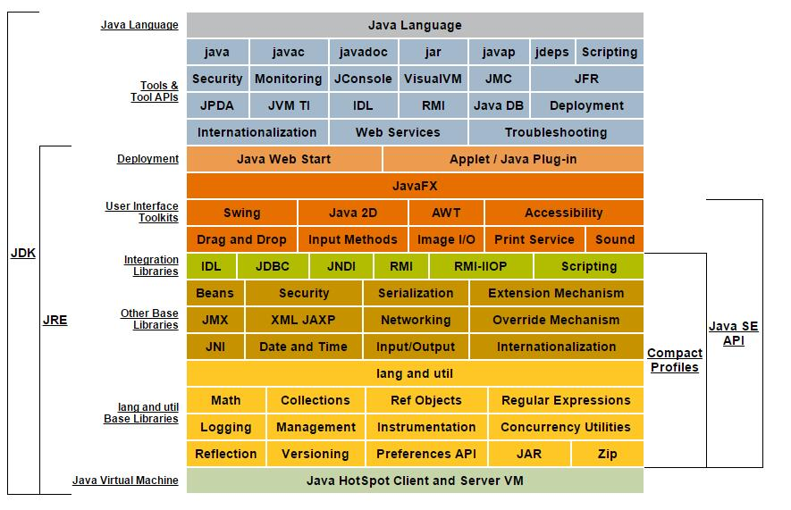
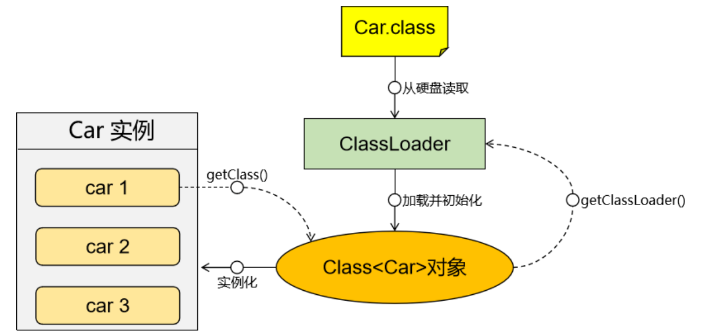
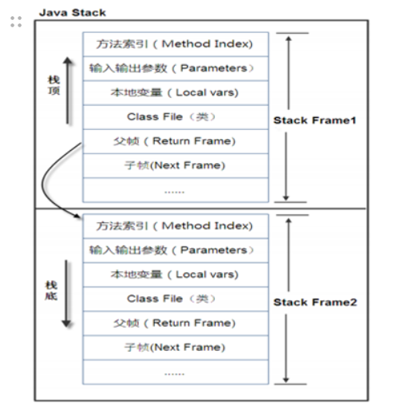
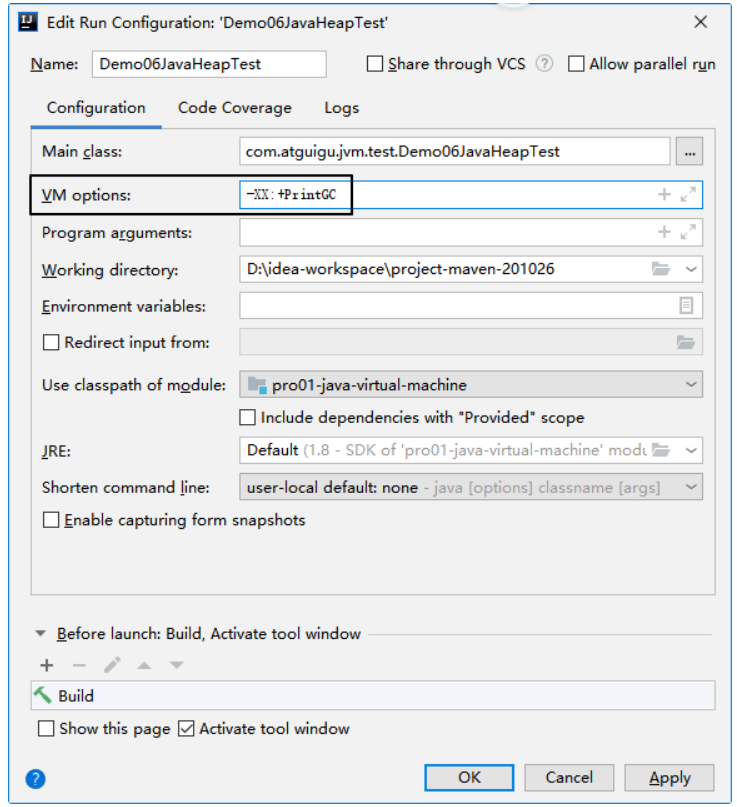

# 第一章 JVM总体机制

## 一、JVM 概念



- JVM：Java Virtual Machine，翻译过来是Java虚拟机
- JRE：Java Runtime Environment，翻译过来是Java运行时环境
  - JRE=JVM+Java程序运行时所需要的类库
- JDK：Java Development Kits，翻译过来是Java开发工具包
  - JDK=JRE+Java开发辅助工具

## 二、JVM工作的总体机制

### 1、Java 源程序编译运行过程

Java源程序→编译→字节码文件→放到JVM上运行

### 2、JVM 工作的总体运行机制

总体机制的粗略描述：

- 第一步：使用类加载器子系统将 *.class 字节码文件加载到 JVM 的内存
- 第二步：在 JVM 的内存空间存储相关数据
- 第三步：在执行引擎中将 *.class 字节码文件翻译成 CPU 能够执行的指令
- 第四步：将指令发送给CPU执行

![[./img/image (1).png]]

### 3、JVM 落地产品

#### ①Sun Classic VM

早在1996年Java1.0版本的时候，Sun公司发布了一款名为Sun Classic VM的Java虚拟机，它同时也是世界上**第一款商用**Java虚拟机，JDK1.4时完全被淘汰。

这款虚拟机内部只提供解释器。

> 目前我们使用的主流JVM中，通常既提供解释器，也提供JIT编译器。在JVM的执行引擎中，既可以使用解释器也可以使用JIT编译器，看具体场景。所以最初的JVM只有解释器是能够工作的。 只有解释器，效率较低。 JIT编译器可以对重复执行的代码进行预编译，提高执行效率。

要想使用JIT编译器，就需要进行外挂。而一旦外挂了JIT编译器，JIT就会接管虚拟机的执行系统。解释器就不再工作。解释器和编译器不能配合工作。

现在Hotspot内置了此虚拟机。

#### ②Exact VM

为了解决Sun Classic VM的问题，JDK1.2时，SUN提供了此虚拟机。

Exact Memory Management：准确式内存管理

- 也可以叫Non-Conservative/Accurate Memory Management
- 虚拟机可以知道内存中某个位置的数据具体是什么类型。
  - 比如一个变量的值是：0xFFE5，分辨它是一个普通整数还是一个地址值。

具备现代高性能虚拟机的雏形

- 热点探测
- 编译器与解释器混合工作模式，仅针对热点代码执行即时编译

只在Solaris（Sun公司的Unix系统）平台短暂使用，其它平台上还是Classic VM。英雄气短，最终被Hotspot虚拟机替换。

> “开始了吗？” “已经结束了。”

#### ③三大商用VM之一：**Hotspot **VM

##### [1]Hotspot历史

- 最初由一家名为“Longview Technologies”的小公司设计
- 1997年，Longview Technologies被Sun收购
- 2009年，Sun公司被Oracle收购
- JDK1.3时，Hotspot VM成为默认虚拟机直到现在

##### [2]市场地位

- 目前Hotspot占有绝对的市场地位，称霸武林
- 不管是现在仍在广泛使用的JDK6，还是新锐JDK8，默认虚拟机都是Hotspot
- Sun/Oracle JDK和Open JDK的默认虚拟机
- 因此本课程中默认介绍的虚拟机都是Hotspot，相关机制也主要是指Hotspot的GC机制。（比如其它两个商用虚拟机：JRockit、J9，都没有方法区的概念）
- 从服务器、桌面应用程序到移动端、嵌入式都有应用

##### [3]名字含义

- Hotspot指的就是它的热点代码探测技术
- 通过计数器找到最具编译价值代码，触发即时编译或栈上替换
- 通过编译器与解释器协同工作，在最优化的程序响应时间与最佳执行性能中取得平衡

栈上替换： 如果一个对象确保只被一个局部变量所引用，那么JVM底层就可以把这个对象拆散，变成几个局部变量分别保存这个对象的各个属性。

栈上替换的好处：

①对象并没有被放在堆空间，而是在栈空间保存，不需要GC 

②放在栈空间，有更大概率是存储在CPU的高速缓存中，进一步提升性能

逃逸分析： 如果一个对象不止被一个局部变量引用，那么就是发生了逃逸，此时不能做栈上替换；乖乖的在堆空间给对象分配存储空间。

#### ④三大商用VM之一：BEA公司的JRockit

- 专注于服务器端应用

  - 不太关注程序启动速度，内部不包含解释器，全部代码都通过JIT编译器执行。

- 大量的行业基准测试显示，JRockit是世界上最快的JVM。

  - 使用JRockit产品，客户已经体验到了显著的性能提高（一些超过了70%）和硬件成本的减少（达50%）。

- 优势：全面的Java运行时解决方案组合

  - JRockit面向延迟敏感型应用的解决方案JRockit Real Time提供以毫秒或微秒级的JVM响应时间，适合财务、军事指挥、电信网络的需要
  - MissionControl服务套件，它是一组以极低的开销来监控、管理和分析生产环境中的应用程序的工具。

- 2008年，BEA被Oracle收购。

- Oracle表达了整合两大优秀虚拟机的意愿，大致在JDK8中完成。整合的方式是在Hotspot的基础上，移植JRockit的优秀特性。

  其实二者架构差异很大，改动并不大。

- 高斯林：目前就职与谷歌，研究人工智能和水下机器人。

#### ⑤三大商用VM之一：IBM的J9

- 全称：IBM Technology for Java Virtual Machine，简称IT4J

- 内部代号：J9

- 市场定位与Hotspot接近，服务器端、桌面应用、嵌入式等多用途VM

- 广泛用于IBM的各种Java产品。

- 目前是有影响力的三大商用虚拟机之一，也**号称**是世界上最快的Java虚拟机。

  > 这个“最快”大概率是基于在IBM自己的产品上测试的结果。 从适应性角度来说，J9也更适合和IBM公司的产品配合使用，例如：WebSphere

- 2017年左右，IBM发布了开源J9 VM，命名为OpenJ9，交给Eclipse基金会管理，也称为Eclipse OpenJ9

# 第二章 类加载机制

## 一、类加载流程

![[./img/image (2).png]]

### 1、读取

- 字节码文件原本存在于本地硬盘上（当然，也有很多其它来源），可以理解为设计师画在纸上的模板。
- 这个模板在执行时需要加载到JVM中，根据模板文件实例化出N个一模一样的实例。
- 字节码文件加载到JVM中，被称为DNA元数据模板，放在方法区
  - 将类的静态存储结构转化为方法区的运行时数据结构
- 整个过程中需要一个运输工具：Class Loader扮演快递员的角色
- 加载过程只执行一次
  - 加载失败：抛出异常
  - 加载成功：以后需要使用这个类，直接执行链接环节
- 在内存中生成一个代表这个类的java.lang.Class对象，作为方法区中这个类的各种数据的访问入口

### 2、链接

#### ①验证（Verify）

- 确保字节码文件的字节流中包含信息符合当前虚拟机要求
- 保证被加载类的正确性
- 不会危害虚拟机自身安全

#### ②准备（Prepare）

- 为类变量分配内存并且设置该类变量的默认初始值，例如int类型默认初始为0。

```Java
// 当前在『准备』环节中，仅仅是将类变量设置为它所在类的默认初始值
// 程序中指定的初始值是在后面『初始化』环节才设置
// 所以代码中，变量a在『准备』环节中被设置成了0
public static int a = 10;
```

- 这里不包含用final修饰的static，因为final类型的常量是在编译时就分配值了，准备阶段会显式初始化。

```Java
// 这是常量，在『准备』环节中，就已经被设置成了100
public final static int x = 100;
```

- 这里不会为实例变量分配初始化，因为类变量会分配在方法区中，而实例变量是会随着对象一起分配到Java堆中

```Java
public class Student{
  // 实例变量，在创建对象时初始化
  private String stuName;
  
  public Student(String stuName){
    this.stuName = stuName;
  }
}
```

#### ③解析（Resolve）

- 将常量池内的符号引用转换为直接引用的过程

![[./img/image (3).png]]

- 事实上，解析操作往往会伴随着JVM在执行完初始化之后再执行
- 符号引用就是一组符号来描述所引用的目标。
  - 符号引用的字面量形式明确定义在《Java虚拟机规范》的字节码文件格式中。
  - 直接引用就是直接指向目标的指针、相对偏移量或一个间接定位到目标的句柄
- 解析动作主要针对类或接口、字段、类方法、接口方法、方法类型等。对应常量池中的：
  - CONSTANT_Class_info
  - CONSTANT_Field_info
  - CONSTANT_Methodref_info

### 3、初始化

- 初始化阶段就是执行类初始化方法<clinit>()的过程
  - cl是class的缩写
- 此方法不需定义，是javac编译器自动收集类中的所有**类变量的赋值动作**和**静态代码块中的语句**合并而来。反过来说，如果当前类中没有类变量，也没有静态代码块，那就没有<clinit>()方法
- 【反直觉】类初始化方法()中指令按语句在源文件中出现的顺序执行

.png)

- <clinit>()不同于类的构造器。在虚拟机视角下，构造器是的<init>()
  - <clinit>()在类初始化时执行
  - <init>()在创建对象时执行

- 若该类具有父类，JVM会保证子类的<clinit>()执行前，父类的<clinit>()已经执行完毕

```java
public class Demo02ClassInit {

    static class Father {
        public static int A = 10;
        static {
            A = 20;
        }
    }

    static class Son extends Father {
        static {
            System.out.println(A);
        }
    }

    public static void main(String[] args) throws ClassNotFoundException {
        Son son = new Son();
        System.out.println("son = " + son);
    }

}
```

- 虚拟机必须保证一个类的<clinit>()方法在多线程下被同步

## 二、类加载器

### 1、概念

- 类加载器子系统负责从文件系统或者网络中加载*.class字节码文件

- 字节码文件开头必须有特定的文件标识

  如果使用二进制文件查看工具打开Java编译得到的字节码文件，会发现，文件开头是：CA FE BA BE

  它们都是十六进制数的符号。

- ClassLoader只负责字节码文件的加载，至于它是否可以运行，则由Execution Engine执行引擎决定的

- 加载的类信息存放于一块称为**方法区**的内存空间。除了类的信息外，方法区中还会存放运行时常量池信息，可能还包括字符串字面量和数字字面量（这部分常量信息是字节码文件中常量池部分的内存映射）



### 2、分类


JVM 中类加载器分为四种：前三种为虚拟机自带的加载器。

| 中文名称       | 英文名称       | 说明                                                         | 加载范围                                                     |
| -------------- | -------------- | ------------------------------------------------------------ | ------------------------------------------------------------ |
| 启动类加载器   | Bootstrap      | C++ 语言编写，不是 ClassLoader 子类，Java 中为 null          | $JAVA_HOME/jre/lib/rt.jar                                    |
| 扩展类加载器   | Extension      | sun.misc.Launcher.ExtClassLoader                             | JAVA_HOME/jre/lib/*.jar -Djava.ext.dirs 参数指定目录下的 jar 包 JAVA_HOME/jre/lib/ext/classes 目录下的 class |
| 应用类加载器   | AppClassLoader | sun.misc.Launcher.AppClassLoader                             | classpath中指定的 jar 包及目录中的 class<br>以及我们导入的第三方框架的jar包 |
| 自定义类加载器 |                | 程序员自己开发一个类继承 java.lang.ClassLoader，<br>定制类加载方式 |                                                              |

### 3、父子关系

- 父子关系1：启动类加载器是扩展类加载器的父加载器
- 父子关系2：扩展类加载器是应用类加载器的父加载器

> 这里的『父子关系』并不是通过子类『继承』父类建立的。 而是在子加载器中**通过parent属性**指向父加载器这样建立的。

### 4、通过代码查看类加载器

```java
// 1.获取Person类的Class对象
// 2.通过Class对象进一步获取它的类加载器对象
ClassLoader appClassLoader = Person.class.getClassLoader();

// 3.获取appClassLoader的全类名
String appClassLoaderName = appClassLoader.getClass().getName();

// 4.打印appClassLoader的全类名
// sun.misc.Launcher$AppClassLoader
System.out.println("appClassLoaderName = " + appClassLoaderName);

// 5.通过appClassLoader获取扩展类加载器（父加载器）
ClassLoader extClassLoader = appClassLoader.getParent();

// 6.获取extClassLoader的全类名
String extClassLoaderName = extClassLoader.getClass().getName();

// 7.打印extClassLoader的全类名
// sun.misc.Launcher$ExtClassLoader
System.out.println("extClassLoaderName = " + extClassLoaderName);

// 8.通过extClassLoader获取启动类加载器（父加载器）
ClassLoader bootClassLoader = extClassLoader.getParent();

// 9.由于启动类加载器是C语言开发的，在Java代码中无法实例化对象，所以只能返回null值
System.out.println("bootClassLoader = " + bootClassLoader);
```

## 三、双亲委派机制

> 『双亲委派机制』这个名字不能顾名思义。 在中文语境下，双亲是指父母；但是这里实际上是指『爸爸』和『爷爷』。

### 1、机制简介

- 当我们需要加载任何一个范围内的类时，首先找到这个范围对应的类加载器
- 但是当前这个类加载器不是马上开始查找
- 当前类加载器会将任务交给上一级类加载器
- 上一级类加载器继续上交任务，一直到最顶级的启动类加载器
- 启动类加载器开始在自己负责的范围内查找
- 如果能找到，则直接开始加载
- 如果找不到，则交给下一级的类加载器继续查找
- 一直到应用程序类加载器
- 如果应用程序类加载器同样找不到要加载的类，那么会抛出ClassNotFoundException

### 2、实验

#### ①实验1

- 第一步：在与JDK无关的目录下创建Hello.java

```java
public class Hello {
  
  public static void main(String[] args){
    System.out.println("AAA");
  }
  
}
```

- 第二步：编译Hello.java
- 第三步：将Hello.class文件移动到$JAVA_HOME/jre/classes目录下
- 第四步：修改Hello.java

```java
public class Hello {
  
  public static void main(String[] args){
    System.out.println("BBB");
  }
  
}
```

- 第五步：编译Hello.java
- 第六步：将Hello.class文件移动到$JAVA_HOME/jre/lib/ext/classes目录下
- 第七步：修改Hello.java

```java
public class Hello {
  
  public static void main(String[] args){
    System.out.println("CCC");
  }
  
}
```

- 第八步：编译Hello.java
- 第九步：使用java命令运行Hello类，发现打印结果是：AAA
  - 说明Hello这个类是被启动类加载器找到的，找到以后就不查找其他位置了
- 第十步：删除$JAVA_HOME/jre/classes目录
- 第十一步：使用java命令运行Hello类，发现打印结果是：BBB
  - 说明Hello这个类是被扩展类加载器找到的，找到以后就不查找其他位置了
- 第十二步：删除$JAVA_HOME/jre/lib/ext/classes目录
- 第十三步：使用java命令运行Hello类，发现打印结果是：CCC
  - 说明Hello这个类是被应用程序类加载器找到的

#### ②实验2

第一步：创建假的String类

```java
package java.lang;

public class String {

    public String() {
        System.out.println("嘿嘿，其实我是假的！");
    }

}
```

第二步：编写测试程序类

```java
    @Test
    public void testLoadString() {

        // 目标：测试不同范围内全类名相同的两个类JVM如何加装
        // 1.创建String对象
        java.lang.String testInstance = new java.lang.String();

        // 2.获取String对象的类加载器
        ClassLoader classLoader = testInstance.getClass().getClassLoader();
        System.out.println(classLoader);
    }
```

第三步：查看运行结果是null

- 假的String类并没有被创建对象，由于双亲委派机制，启动类加载器加载了真正的String类

### 3、小结

双亲委派机制的好处：

- 避免类的重复加载：父加载器加载了一个类，就不必让子加载器再去查找了。同时也保证了在整个 JVM 范围内**全类名是类的唯一标识**。
- 安全机制：避免恶意替换 JRE 定义的核心 API。这方面还有一个名词『**沙箱安全机制**』。

# 第三章 总体机制中不重要的部分

## 一、本地接口 Native Interface

本地接口的作用是融合不同的编程语言为 Java 所用，它的初衷是融合 C/C++程序。因为 Java 诞生的时候是 C/C++ 横行的时候，要想立足，必须有能力调用 C/C++。于是就在内存中专门开辟了一块区域处理标记为 native 的代码，它的具体做法是 Native Method Stack 中登记 native 方法，在Execution Engine 执行时加载 native libraies。

目前该方法使用的越来越少了，除非是与硬件有关的应用，比如通过 Java 程序驱动打印机或者 Java 系统管理生产设备，在企业级应用中已经比较少见。因为现在的异构领域间的通信很发达，比如可以使用 Socket 通信，也可以使用 Web Service 等等，不多做介绍。

## 二、本地方法栈 Native Method Stack

专门负责在本地方法运行时，提供栈空间，存放本地方法每一次执行时创建的栈帧。它的具体做法是在 Native Method Stack 中登记 native 方法，在 Execution Engine 执行时加载本地方法库。

native 方法举例：

```Java
public static native void yield();
```

## 三、程序计数器

也叫PC寄存器（**P**rogram **C**ounter Register）。用于保存程序执行过程中，下一条即将执行的指令的地址。也就是说能够保存程序当前已经执行到的位置。这个位置由执行引擎读取下一条指令，是一个非常小的内存空间，从内存空间使用优化这个角度来看：几乎可以忽略不记。

## 四、执行引擎 Execution Engine

.png)

作用：用于执行字节码文件中的指令。

执行指令的具体技术：

- 解释执行：第一代JVM。
- 即时编译：JIT，第二代JVM。
- 自适应优化：目前Sun的Hotspot JVM采用这种技术。吸取了第一代JVM和第二代JVM的经验，在一开始的时候对代码进行解释执行， 同时使用一个后台线程监控代码的执行。如果一段代码经常被调用，那么就对这段代码进行编译，编译为本地代码，并进行执行优化。若方法不再频繁使用，则取消编译过的代码，仍对其进行解释执行。
- 芯片级直接执行：内嵌在芯片上，用本地方法执行Java字节码。

## 五、直接内存

.png)

### 1、作用

在特定场景提高性能。

### 2、应用场景

直接内存并不是虚拟机运行时数据区的一部分，也不是Java 虚拟机规范中定义的内存区域。在JDK1.4 中新加入了NIO(New Input/Output)类，引入了一种基于通道（Channel）与缓冲区（Buffer）的 I/O 方式，它可以使用native 函数库直接分配堆外内存，然后通过一个存储在 Java 堆中的 DirectByteBuffer 对象作为这块内存的引用进行操作。这样能在一些场景中显著提高性能，因为避免了在 Java 堆和 Native 堆中来回复制数据。 本机直接内存的分配不会受到 Java 堆大小的限制，受到本机总内存大小限制。 配置虚拟机参数时，不要忽略直接内存防止出现 OutOfMemoryError 异常。

### 3、直接内存和堆内存比较

直接内存申请空间耗费更高的性能，当频繁申请到一定量时尤为明显。直接内存 I/O 读写的性能要优于普通的堆内存，在多次读写操作的情况下差异明显。

# 第四章 方法区

## 一、概念

- 标准层面：方法区（Method Area）
- 具体实现层面：
  - ≤1.6 永久代（PermGen）
  - =1.7 永久代仍然存在，但是已经开始提出：去永久代
  - ≥1.8元空间（Meta Space）

## 二、概念的辨析

- 从方法区角度来说
  - 方法区的具体实现：JDK 版本 ≤ 1.7 时，使用永久代作为方法区。
  - 方法区的具体实现：JDK 版本 ≥ 1.8 时，使用元空间作为方法区。
- 从堆空间角度来说
  - 新生代：从标准和实现层面都确定属于堆
  - 老年代：从标准和实现层面都确定属于堆
  - 永久代
    - 名义上属于堆
    - 实现上不属于堆，它另外有一个名字叫：非堆（Non-heap）

.png)

## 三、方法区存放内容

- 类信息：类中定义的构造器、接口定义
- 静态变量（类变量）
- 常量
- 运行时常量池
- 类中方法的代码

## 四、类加载机制和方法区的关系

- 类加载到JVM内存后，类的静态存储结构转化为方法区的运行时数据结构
- 类加载后，会在内存中生成一个代表这个类的java.lang.Class对象，作为方法区中这个类的各种数据的访问入口
- 类的字节码文件中有存放静态数据的常量池，类加载到内存后，字节码文件中的常量池会映射到方法区中的常量池

.png)

## 五、代码示例

.png)

# 第五章 Java栈

## 一、总体结构

.png)

栈帧的概念： 方法的每一次调用都会产生一个栈帧，线程中每一次调用一个方法，就会在Java栈中开辟一块空间保存栈帧。 方法执行完成，栈帧就会被释放。 整个线程要调用的所有方法都执行完成，则整个线程空间释放。

## 二、栈帧

栈帧的概念： 方法的每一次调用都会产生一个栈帧，线程中每一次调用一个方法，就会在Java栈中开辟一块空间保存栈帧。 方法执行完成，栈帧就会被释放。 整个线程要调用的所有方法都执行完成，则整个线程空间释放。

### 1、栈帧存储的数据

方法在本次执行过程中所用到的局部变量、动态链接、方法出口等信息。栈帧中主要保存3 类数据：

- 本地变量（Local Variables）：也叫局部变量，输入参数和输出参数以及方法内的变量。

```java
// 返回值：输出的参数
public int sum(
        // 参数列表：输入的参数
        int i, int j) {

    // 方法内的变量
    int result = i + j;

    return result;
}
```

- 栈操作（Operand Stack）：记录出栈、入栈的操作。
- 栈帧数据（Frame Data）：包括类文件、方法等等。

### 2、栈帧的结构

- 局部变量表：方法执行时的参数、方法体内声明的局部变量
- 操作数栈：存储中间运算结果，是一个临时存储空间
- 帧数据区：保存访问常量池指针，异常处理表

### 3、栈帧工作机制

当一个方法 A 被调用时就产生了一个栈帧 F1，并被压入到栈中，

A 方法又调用了 B 方法，于是产生栈帧 F2 也被压入栈，

B 方法又调用了 C 方法，于是产生栈帧 F3 也被压入栈，

……

C 方法执行完毕后，弹出 F3 栈帧；

B 方法执行完毕后，弹出 F2 栈帧；

A 方法执行完毕后，弹出 F1栈帧；

……

遵循“先进后出”或者“后进先出”原则。



图示在一个栈中有两个栈帧：

栈帧 2 是最先被调用的方法，先入栈，

然后方法 2 又调用了方法 1，栈帧 1 处于栈顶的位置，

栈帧 2 处于栈底，执行完毕后，依次弹出栈帧 1 和栈帧 2，

线程结束，栈释放。

每执行一个方法都会产生一个栈帧，保存到栈的顶部，顶部栈就是当前方法，该方法执行完毕后会自动将此栈帧出栈。

> 两组配套概念： 
>
> ①串行，同步操作，按顺序执行，前一个操作不执行完后面操作就要等待
>
>  ②并行，异步操作，CPU调度，不同操作之间不需要互相等待

## 三、典型案例

请预测下面代码打印的结果：34

```java
int n = 10;
n += (n++) + (++n);
System.out.println(n);
```

实际执行结果：32

使用 javap 命令查看字节码文件内容：

> D:\record-video-original\day03\code>javap -c Demo03JavaStackExample.class
>  Compiled from "Demo03JavaStackExample.java"
>  public class Demo03JavaStackExample{
>  public Demo03JavaStackExample();
>  Code:
>  0: aload_0
>  1: invokespecial #1 // Method java/lang/Object."<init>: ()V
>  4: return

> public static void main(java.lang.String[]);
>  Code:
>  0: bipush 10
>  2: istore_1
>  3: iload_1
>  4: iload_1
>  5: iinc 1, 1
>  8: iinc 1, 1
>  11: iload_1
>  12: iadd
>  13: iadd
>  14: istore_1
>  15: getstatic #2 // Field java/lang/System.out:Ljava/io/PrintStream;
>  18: iload_1
>  19: invokevirtual #3 // Method java/io/PrintStream.println:(I)V
>  22: return
>  }

内存执行过程分析：

.png)

## 四、栈溢出异常

### 1、异常名称

java.lang.StackOverflowError

### 2、异常产生的原因

下面的例子是一个没有退出机制的递归：

```Java
public class StackOverFlowTest {

    public static void main(String[] args) {
        methodInvokeToDie();
    }

    public static void methodInvokeToDie() {
        methodInvokeToDie();
    }

}
```

抛出的异常信息：

> Exception in thread "main" java.lang.StackOverflowError at com.atguigu.jvm.test.StackOverFlowTest.methodInvokeToDie(StackOverFlowTest.java:10) at com.atguigu.jvm.test.StackOverFlowTest.methodInvokeToDie(StackOverFlowTest.java:10) at com.atguigu.jvm.test.StackOverFlowTest.methodInvokeToDie(StackOverFlowTest.java:10) at com.atguigu.jvm.test.StackOverFlowTest.methodInvokeToDie(StackOverFlowTest.java:10) at com.atguigu.jvm.test.StackOverFlowTest.methodInvokeToDie(StackOverFlowTest.java:10)

原因总结：方法每一次调用都会在栈空间中申请一个栈帧，来保存本次方法执行时所需要用到的数据。但是一个没有退出机制的递归调用，会不断申请新的空间，而又不释放空间，这样迟早会把当前线程在栈内存中自己的空间耗尽。

> 『没有退出机制的递归』是产生栈溢出异常的典型原因，但不是唯一原因。也可能是栈空间给每个线程分配的内存大小确实不够。

## 五、栈空间中线程独立运行

在多线程运行过程中，某一个线程抛出异常停止执行不会影响到其它线程。

# 第六章 堆

## 一、概述

### 1、堆空间存储结构

.png)

### 2、堆空间工作机制

- 新创建的对象会被放在Eden区
- 当Eden区中已使用的空间达到一定比例，会触发Minor GC
- 每一次在Minor GC中没有被清理掉的对象就成了幸存者
- 幸存者对象会被转移到幸存者区
- 幸存者区分成from区和to区
- from区快满的时候，会将仍然在使用的对象转移到to区
- 然后from和to这两个指针彼此交换位置

> 口诀：复制必交换，谁空谁为to

- 如果一个对象，经历15次GC仍然幸存，那么它将会被转移到老年代
- 如果幸存者区已经满了，即使某个对象尚不到15岁，仍然会被移动到老年代
- 最终效果：
  - Eden区主要是生命周期很短的对象来来往往
  - 老年代主要是生命周期很长的对象，例如：IOC容器对象、线程池对象、数据库连接池对象等等
  - 幸存者区作为二者之间的过渡地带
- 关于永久代：
  - 从理论上来说属于堆
  - 从具体实现上来说不属于堆

### 3、堆、栈、方法区之间关系

.png)

### 4、常驻内存对象举例

> 数据库连接池对象（**容器**）
>
> 数据库连接 1
>
> 数据库连接 2
>
> 数据库连接 N
>
> ……
>
> 第三方中间件的Java客户端对象
>
> Jedis
>
> RabbitMQ客户端对象
>
> ElasticSearch客户端对象
>
> ……
>
> IOC**容器**对象 ApplicationContext iocContainer = new  ClasspathXmlApplicationContext("xxx.xml");
>
> 我们自己创建的组件：EmpController对象
>
> 我们自己创建的组件：EmpService对象
>
> 我们自己创建的组件：EmpMapper对象
>
> 框架内部的组件：PlatformTransactionManagement
>
> 框架内部的组件：ExecutionChain
>
> 框架内部的组件：DispatcherServlet
>
> 框架内部的组件：CharacterEncodingFilter
>
> 框架内部的组件：HiddenMethodFilter
>
> 框架内部的组件：ContextLoaderListener
>
> 线程池（**容器**）
>
> 线程对象 1
>
> 线程对象 2
>
> 线程对象 N
>
> ……
>
> Servlet**容器**
>
> ServletContext
>
> HttpSession

### 5、常用Web对象存活时间

生产环境下：

ServletContext存活时间：

> 时间单位：月、年

HttpSession存活时间：

> 时间单位：分钟、小时

HttpServletRequest存活时间：服务器端接收到请求~服务器提交响应

> 时间单位：秒或毫秒

HttpServletResponse存活时间：服务器端接收到请求~服务器给客户端返回了响应数据

> 时间单位：秒或毫秒

## 二、实验

### 1、测试代码

查看下面程序在每个步骤中内存的状态：

```Java
public class Review {

    // 静态变量，类变量
    public static Review review = new Review();

    public void showMessage() {

        // 局部变量
        Review reviewLocal = new Review();

    }

    // 程序入口
    public static void main(String[] args) {

        // 局部变量
        Review reviewMain = new Review();

        // 通过局部变量调用对象的方法
        reviewMain.showMessage();

        // 手动 GC
        System.gc();
        
        // 循环操作，让程序运行久一点
        for(int i = 0; i < 100; i++){
            TimeUnit.SECONDS.sleep(1);
        }
    }
}
```

### 2、各状态分析

#### 状态1：类加载过程链接阶段准备环节

.png)

#### 状态2：类加载过程初始化阶段

有类变量需要初始化，字节码文件中会生出<clinit>()方法，创建Review对象并赋值给类变量就是在<clinit>()方法中执行的。

.png)

#### 状态3：调用main()方法

.png)

#### 状态4：main()方法内创建对象

.png)

#### 状态5：调用对象的showMessage()方法

.png)

#### 状态6：showMessage()方法内创建新的对象

.png)

#### 状态7：showMessage()方法结束

该方法的栈帧被释放，栈帧内的局部变量也被释放。0xEEAA这个对象就成了断了线的风筝。

.png)

#### 状态8：手动GC

.png)

#### 状态9：幸存者区GC

##### [1]第一步

将存活对象从from区移动到to区。

.png)

##### [2]第二步

原来的from区被清空，交换指针

> 口诀：复制必交换，谁空谁为to

.png)

##### 状态10：进入老年代

.png)

##### 状态11：程序结束

main()方法结束 → main线程结束 → JVM进程结束 → JVM的整个内存空间全部释放。

###### [1]main()方法结束

main()方法栈帧被释放

.png)

###### [2]GC

.png)

## 三、JVM参数设置入门

### 1、IDEA 中的设置方式

我这里的 IDEA 版本：

- 新创建参数设置：

.png)

- 修改参数设置：

.png)

- 设置参数：



- 运行程序的操作还是和以前一样：

.png)

### 2、Runtime类使用案例

```java
System.out.print("最多可以申请的堆大小：");
System.out.println(Runtime.getRuntime().maxMemory() / 1024.0 / 1024 + "M");

System.out.print("当前已申请到的堆大小：");
System.out.println(Runtime.getRuntime().totalMemory() / 1024.0 / 1024 + "M");
System.out.println("==================================================");

byte[] b = null;
for (int i = 0; i < 10; i++) {
  b = new byte[1 * 1024 * 1024];
}
```

执行前配置参数：-Xmx50m -Xms30m -XX:+PrintGCDetails

执行看到如下信息：

.png)

新生代和老年代的堆大小之和是Runtime.getRuntime().totalMemory()

### 3、GC演示

JVM参数设置成最大可申请堆内存100M，初始化时申请堆内存10M：-Xmx100m -Xms10m -XX:+PrintGCDetails

```Java
System.out.println("=====================Begin=========================");
System.out.print("最大可申请的堆大小：Xmx=");
System.out.println(Runtime.getRuntime().maxMemory() / 1024.0 / 1024 + "M");

System.out.print("空闲(已申请但尚未使用)的堆大小：free mem=");
System.out.println(Runtime.getRuntime().freeMemory() / 1024.0 / 1024 + "M");

System.out.print("当前已申请的堆大小：total mem=");
System.out.println(Runtime.getRuntime().totalMemory() / 1024.0 / 1024 + "M");

System.out.println("==================First Allocated===================");
byte[] b1 = new byte[5 * 1024 * 1024];
System.out.println("5MB array allocated");

System.out.print("空闲(已申请但尚未使用)的堆大小：free mem=");
System.out.println(Runtime.getRuntime().freeMemory() / 1024.0 / 1024 + "M");

System.out.print("当前堆大小：total mem=");
System.out.println(Runtime.getRuntime().totalMemory() / 1024.0 / 1024 + "M");

System.out.println("=================Second Allocated===================");
byte[] b2 = new byte[10 * 1024 * 1024];
System.out.println("10MB array allocated");

System.out.print("空闲(已申请但尚未使用)的堆大小：free mem=");
System.out.println(Runtime.getRuntime().freeMemory() / 1024.0 / 1024 + "M");

System.out.print("当前堆大小：total mem=");
System.out.println(Runtime.getRuntime().totalMemory() / 1024.0 / 1024 + "M");

System.out.println("=====================OOM=========================");
System.out.println("OOM!!!");
System.gc();

System.out.println("第一个 40M 数组");
byte[] b3 = new byte[40 * 1024 * 1024];

System.out.println("第二个 40M 数组");
byte[] b4 = new byte[40 * 1024 * 1024];

System.out.println("第三个 40M 数组");
byte[] b5 = new byte[40 * 1024 * 1024];
```

运行这个程序，可以看到minor GC和full GC日志：

.png)

本例打印中的名词说明：

- **GC**：也称为 **minor GC**，仅在**新生代**执行的小范围 GC。

  > 证据：[GC (System.gc()) [PSYoungGen: 1965K->504K(2560K)] 17325K->16096K(20480K), 0.0035293 secs]

- **Full GC**：也称为** major GC**，在整个**堆空间和方法区**执行的 GC。

  > 证据：[Full GC (System.gc()) [PSYoungGen: 504K->0K(2560K)] [ParOldGen: 15592K->16048K(17920K)] 16096K->16048K(20480K), [Metaspace: 3485K->3485K(1056768K)], 0.0152360 secs]

### 4、堆溢出异常

#### ①异常名称

java.lang.OutOfMemoryError，也往往简称为 OOM。

#### ②异常信息

- Java heap space：针对新生代、老年代整体进行Full GC后，内存空间还是放不下新产生的对象，且无法申请更多的空间
- PermGen space：永久代溢出。方法区中加载的类太多了（典型情况是框架创建的动态类太多，导致方法区溢出）
- Metaspace：元空间溢出。方法区中加载的类太多了（典型情况是框架创建的动态类太多，导致方法区溢出）

我们可以参考下面的控制台日志打印：

> 4479044K(5161984K), 4.3454766 secs] [Full GC (Ergonomics) 4479044K->3862071K(5416448K), 39.3706285 secs] [Full GC (Ergonomics) 4410423K->4410422K(5416448K), 27.7039534 secs] [Full GC (Ergonomics) 4629575K->4621239K(5416448K), 24.9298221 secs] [Full GC (Allocation Failure) 4621239K->4621186K(5416448K), 29.0616791 secs] Exception in thread "main" java.lang.OutOfMemoryError: **Java heap space** at java.util.Arrays.copyOf(Arrays.java:3210) at java.util.Arrays.copyOf(Arrays.java:3181) at java.util.ArrayList.grow(ArrayList.java:261) at java.util.ArrayList.ensureExplicitCapacity(ArrayList.java:235) at java.util.ArrayList.ensureCapacityInternal(ArrayList.java:227) at java.util.ArrayList.add(ArrayList.java:458) at com.atguigu.jvm.test.JavaHeapTest.main(JavaHeapTest.java:16)

『新生代、老年代』、『永久代』、『元空间』发生空间不够而溢出的错误时，抛出的都是java.lang.OutOfMemoryError这同一个类型的异常。那么怎么能区分到底是哪个区域空间不够呢？ 那就需要具体查看java.lang.OutOfMemoryError的异常提示信息：

- Java heap space表示『老年代』溢出，也就是我们平时说的『堆溢出』 
- PermGen space表示『永久代』溢出 
- Metaspace表示『元空间』溢出

方法区为啥会溢出？ 基本就是方法区里加载的类太多了。而最典型的情况就是框架运行过程中由于某些错误导致动态生成的类太多了。 哪些情况下，框架会动态生成新的类呢？ 

- 凡是我们自己只需要调用接口的方法，不需要给接口提供实现类的情况，都需要框架动态生成类。大概率是JDK的动态代理。 

	- 例如：在Mybatis中调用Mapper接口 

	- 例如：给有接口的类套上AOP 

	- 例如：通过Feign接口调用微服务 

- 给没有接口的类套上AOP，底层使用CGLIB，CGLIB需要动态生成类来继承目标类。

## 四、可视化工具

### jconsole

#### 一、所在路径

%JAVA_HOME%/bin/jconsole.exe

#### 二、使用方法

双击打开，选择要监控的进程：

.png)

如果想要重新打开新建连接窗口可以点击菜单项：

.png)

.png)

.png)

.png)

可以选择内存选项卡，在图表下拉列表中选择想要查看的具体的内存区域：

.png)

.png)

### jvisualvm

#### 一、所在路径

%JAVA_HOME%/bin/jvisualvm.exe

#### 二、使用方法

双击打开，从本地进程列表中选择要监控的进程：

.png)

选中的进程要双击打开：

.png)

.png)

# 第七章 GC

为什么要有垃圾回收？

- 线程私有空间：无需由系统来执行GC。因为线程结束，释放自己刚才使用的空间即可，不影响其它线程。 

- 线程共享空间：任何一个线程结束时，都无法确定刚才使用的空间是不是还有别的线程在使用。所以不能因为线程结束而释放空间，必须在系统层面统一垃圾回收。

## 一、标记垃圾对象

### 1、引用计数法（不采用）

#### ①本意

- 在对象内部记录被引用次数
- 被引用一次，计数器 + 1
- 引用解除一个，计数器 - 1
- 计数器归零则表示该对象变成垃圾

#### ②问题

循环引用问题，会导致计数器无法归零。

##### [1]一对多关联关系

Customer 类：

```Java
public class Customer {

    private List<Order> orderList;

    public List<Order> getOrderList() {
        return orderList;
    }

    public void setOrderList(List<Order> orderList) {
        this.orderList = orderList;
    }
}
```

Order 类：

```Java
public class Order {

    private Customer customer;

    public Customer getCustomer() {
        return customer;
    }

    public void setCustomer(Customer customer) {
        this.customer = customer;
    }
}
```

##### [2]SpringMVC 组件

- IOC 容器对象的接口类型：WebApplicationContext
  - WebApplicationContext 对象初始化过程中：将它自己存入 ServletContext 域
  - WebApplicationContext 对象也会把 ServletContext 存入 IOC 容器
- Servlet 上下文对象：ServletContext

.png)

### 2、GC Roots 可达性分析

核心原理：判断一个对象，是否存在从『**堆外**』到『**堆内**』的引用。

.png)

### 3、GC Root 对象

GC Root 对象：就是作为根节点出发，顺着引用路径一直查找到堆空间内，找到堆空间中的对象。

- Java 栈中的局部变量
- 本地方法栈中的局部变量
- 方法区中的类变量、常量

## 二、垃圾回收算法

### 1、基本算法

#### ①引用计数法（不采用）

优点：

- 实时性较高，不需要等到内存不够时才回收
- 垃圾回收时不用挂起整个程序，不影响程序正常运行

缺点：

- 回收时不移动对象, 所以会造成内存碎片问题
- 不能解决对象间的**循环引用**问题（致命问题，一票否决）

小结：

正是由于引用计数法不能解决对象间的循环引用问题，所以事实上并没有哪一款 JVM 产品采用这个机制。

> Stop-The-World：字面意思让整个世界停止。在 GC 机制中，Stop-The-World 表示挂起整个 JVM 程序，等执行完垃圾回收之后，再继续执行 JVM 程序。Stop-The-World 通常也会简称为 STW。

#### ②标记清除法

它的做法是当堆中的有效内存空间被耗尽的时候，就会暂停、挂起整个程序（也被称为stop the world），然后进行两项工作，第一项则是标记，第二项则是清除。

- 标记：标记的过程其实就是，从根对象开始遍历所有的对象，然后将所有存活的对象标记为可达的对象。
- 清除：清除的过程将遍历堆中所有的对象，将没有标记的对象全部清除掉。

小结：

- 优点：实现简单
- 缺点：
  - 效率低，因为标记和清除两个动作都要遍历所有的对象
  - 垃圾收集后有可能会造成大量的内存碎片
  - 垃圾回收时会造成应用程序暂停

.png)

#### ③标记压缩法

既然叫标记压缩算法，那么它也分为两个阶段，一个是标记(mark)，一个是压缩(compact)。所谓压缩就是把存在碎片的空间连起来。

标记压缩算法是在标记清除算法的基础之上，做了优化改进的算法。和标记清除算法一样，也是从根节点开始，对对象的引用进行标记，在清理阶段，并不是简单的清理未标记的对象，而是将存活的对象移动到内存的一端，然后清理边界以外的垃圾，从而解决了碎片化的问题。

- 标记 : 标记的过程其实就是，从根对象开始遍历所有的对象，然后将所有存活的对象标记为可达的对象。
- 压缩 : 移动所有的可达对象到堆内存的同一个区域中，使他们紧凑的排列在一起，从而将所有非可达对象释放出来的空闲内存都集中在一起，通过这样的方式来达到减少内存碎片的目的。

小结

- 优点：标记压缩算法是对标记清除算法的优化，解决了碎片化的问题
- 缺点：还是效率问题，在标记清除算法上又多加了一步，效率可想而知了

.png)

#### ④复制算法

复制算法的核心就是，将原有的内存空间一分为二，每次只用其中的一块，在垃圾回收时，将正在使用的对象复制到另一个内存空间中，并依次排列，然后将该内存空间清空，交换两个内存的角色，完成垃圾的回收。

小结

- 优点1：在垃圾多的情况下(新生代)，效率较高
- 优点2：清理后，内存无碎片
- 缺点：浪费了一半的内存空间，在存活对象较多的情况下(老年代)，效率较差

执行GC前：

.png)

执行标记：

.png)

执行复制：

.png)

交换指针：

.png)

### 2、综合算法

#### ①分代算法

前面介绍了多种回收算法，每一种算法都有自己的优点也有缺点，谁都不能替代谁，所以根据垃圾回收对象的特点进行选择，才是明智的。

分代算法其实就是这样的，根据回收对象的特点进行选择。

新生代适合使用复制算法 老年代适合使用标记清除或标记压缩算法

#### ②分区算法

上面介绍的分代收集算法是将对象的生命周期按长短划分为两个部分，而分区算法则将整个堆空间划分为连续的不同小区间，每个小区间独立使用，独立回收。这样做的好处是可以控制一次回收多少个小区间。在相同条件下，堆空间越大。一次GC耗时就越长，从而产生的停顿也越长。为了更好地控制GC产生的停顿时间，将一块大的内存区域分割为多个小块，根据目标停顿时间每次合理地回收若干个小区间(而不是整个堆)，从而减少一次GC所产生的停顿。

## 三、垃圾回收器[了解]

> 垃圾回收器没有在规范中进行过多的规定，可以由不同厂商、不同版本的JVM来各自实现。 由于JDK的版本处于高速迭代过程中，因此Java发展至今已经衍生了众多的垃圾回收器产品。 从不同角度分析垃圾回收器，可以将GC分为不同的类型。

### 1、串行垃圾回收器

串行：在一个线程内执行垃圾回收操作。

新生代串行回收器 SerialGC：采用复制算法实现，单线程垃圾回收，独占式垃圾回收器

老年代串行回收器 SerialOldGC：采用标记压缩算法，单线程独占式垃圾回收器

### 2、并行垃圾回收器

并行：在多个线程中执行垃圾回收操作。

新生代 ParNew 回收器：采用复制算法实现，多线程回收器，独占式垃圾回收器。

新生代 ParallelScavengeGC 回收器：采用复制算法多线程独占式回收器

老年代 ParallelOldGC 回收器: 采用标记压缩算法，多线程独占式回收器

- CMS回收器

  CMS全称 (Concurrent Mark Sweep)，是一款并发的、使用标记-清除算法的垃圾回收器。对CPU资源非常敏感。

  启用CMS回收器参数 ：-XX:+UseConcMarkSweepGC。

  使用场景：GC过程短暂停顿，适合对时延要求较高的服务，用户线程不允许长时间的停顿。

  优点：最短回收停顿时间为目标的收集器。并发收集，低停顿。

  缺点：服务长时间运行，造成严重的内存碎片化。算法实现比较复杂。

- G1回收器

  G1(Garbage-First)是一款面向服务端应用的并发垃圾回收器, 主要目标用于配备多颗CPU的服务器，治理大内存。是JDK1.7提供的一个新收集器，是当今收集器技术发展的最前沿成果之一。

  G1计划是并发标记-清除收集器的长期替代品。

  启用G1收集器参数：-XX:+UseG1GC启用G1收集器。

  G1将整个Java堆划分为多个大小相等的独立区域(Region)，虽然还保留有新生代和老年代的概念，但新生代和老年代不再是物理隔离的了, 它们都是一部分Region(不需要连续)的集合。

.png)

每块区域既有可能属于Old区、也有可能是Young区，因此不需要一次就对整个老年代/新生代回收。而是当线程并发寻找可回收的对象时，有些区块包含可回收的对象要比其他区块多很多。虽然在清理这些区块时G1仍然需要暂停应用线程，但可以用相对较少的时间优先回收垃圾较多的Region(这也是G1命名的来源)。这种方式保证了G1可以在有限的时间内获取尽可能高的收集效率。

特点：

- 一整块堆内存被分成多个独立的区域Regions
- 存活对象被拷贝到新的Survivor区
- 新生代内存由一组不连续的堆heap区组成，使得可以动态调整各个区域
- 多线程并发GC
- young GC会有STW（Stop the world）事件

### 3、垃圾回收器对比

#### ①新生代回收器

| 名称               | 串行/并行/并发 | 回收算法 | 适用场景          | 可以与CMS配合 |
| ------------------ | -------------- | -------- | ----------------- | ------------- |
| SerialGC           | 串行           | 复制     | 单CPU             | 是            |
| ParNewGC           | 并行           | 复制     | 多CPU             | 是            |
| ParallelScavengeGC | 并行           | 复制     | 多CPU且关注吞吐量 | 否            |

#### ②老年代回收器

| 名称        | 串行/并行/并发             | 回收算法 | 适用场景              |
| ----------- | -------------------------- | -------- | --------------------- |
| SerialOldGC | 串行                       | 标记压缩 | 单CPU                 |
| ParNewOldGC | 并行                       | 标记压缩 | 多CPU                 |
| CMS         | 并发，几乎不会暂停用户线程 | 标记清除 | 多CPU且与用户线程共存 |

## 四、finalize 机制

### 1、总体介绍

java.lang.Object 类中有一个方法：

```Java
protected void finalize() throws Throwable { }
```

方法体内是空的，说明如果子类不重写这个方法，那么不执行任何逻辑。

.png)

在执行 GC 操作前，调用 finalize() 方法的是 Finalizer 线程，这个线程优先级很低。

在对象的整个生命周期过程中，finalize() 方法只会被调用一次。

### 2、代码验证

```Java
public class FinalizeTest {

    // 静态变量
    public static FinalizeTest testObj;

    @Override
    protected void finalize() throws Throwable {
        // 重写 finalize() 方法
        System.out.println(Thread.currentThread().getName() + " is working");

        // 给待回收的对象（this）重新建立引用
        testObj = this;
    }

    public static void main(String[] args) {

        // 1、创建 FinalizeTest 对象
        FinalizeTest testObj = new FinalizeTest();

        // 2、取消引用
        testObj = null;

        // 3、执行 GC 操作
        System.gc();

        // ※ 让主线程等待一会儿，以便调用 finalize() 的线程能够执行
        try { TimeUnit.SECONDS.sleep(3);} catch (InterruptedException e) {}

        // 4、判断待回收的对象是否存在
        if (FinalizeTest.testObj == null) {
            System.out.println("待回收的对象没有获救，还是要被 GC 清理");
        } else {
            System.out.println("待回收的对象被成功解救");
        }

        // 5、再次取消引用
        FinalizeTest.testObj = null;

        // 6、再次执行 GC 操作
        System.gc();

        // 7、判断待回收的对象是否存在
        if (FinalizeTest.testObj == null) {
            System.out.println("待回收的对象没有获救，还是要被 GC 清理");
        } else {
            System.out.println("待回收的对象被成功解救");
        }
    }

}
```

执行效果：

> Finalizer is working
>  待回收的对象被成功解救
>  待回收的对象没有获救，还是要被 GC 清理

# 第八章 面试题

## 一、请谈谈你对 JVM 的理解？

- JVM 技术的作用：提升、优化项目性能
- JVM 结构
  - 类加载机制
  - Java栈
  - 堆
    - 新生代
      - Eden 区
      - 幸存者区：S0+S1
    - 老年代
  - 元空间
- GC
  - 垃圾对象的标记
    - 引用技术法
    - GC Roots：概念→原理（堆外指向堆内）→GC Root 对象
  - 垃圾回收算法
- JVM 常用参数

## 二Java 8 的虚拟机有什么更新？

- 永久代取消，变成元空间；
- 常量池放入到元空间，但是一直都是在方法区中。

## 三、什么是OOM？

- 概念：内存溢出错误
- 全类名：java.lang.OutofMemoryError
- 产生原因：
  - Java heap space：经过多轮 GC，连老年代都已经没了空间，还要继续创建新的对象。
  - PermGen space：永久代空间不足
  - Metaspace：元空间溢出
- 相关拓展：StackOverFlowError

## 四、什么是StackOverflowError?

- 概念：栈内存溢出错误
- 产生原因：在一个线程中，栈内存分配给它的空间被不断新增的栈帧填满，没有及时释放栈帧。
- 详细过程：栈帧概念，栈帧中存储的数据，典型情况（无法退出的递归）
- 相关拓展：OOM

## 五、JVM 的常用参数调优你知道哪些？

| 参数名            | 星标 | 说明                                                       |
| ----------------- | ---- | ---------------------------------------------------------- |
| -Xms              | ★    | 堆内存的初始大小                                           |
| -Xmx              | ★    | 堆内存的最大值（最多能够向操作系统申请多少）               |
| -Xss              | ☆    | 每个线程在Java 栈中占用空间的大小。                        |
| -Xmn              |      | 新生代大小                                                 |
| -XX:PermSize      |      | 设置永久代(perm gen)初始值                                 |
| -XX:MaxPermSize   |      | 设置永久代最大值                                           |
| -XX:NewRatio      |      | 年轻代(包括Eden和两个Survivor区)与年老代的比值(除去持久代) |
| -XX:SurvivorRatio |      | Eden区与Survivor区的大小比值                               |

> -Xss 设置每个线程在Java 栈中占用空间的大小。

线程数量 = Java 栈空间 / 每个线程空间(-Xss 参数设置的值)

线程深度 = 每个线程空间 / 每个栈帧空间

如果项目希望线程深度更大，那么应该给每个线程设置较大空间；

如果项目线程深度不大，线程数量很多，那么应该给每个线程设置较小空间。

线程深度：在一个线程中能够连续调用的方法的数量。

## 六、谈谈 JVM 中，对类加载器你的认识？

双亲委派机制

- 类加载器分类
  - 启动类加载器
  - 扩展类加载器
  - 应用类加载器
  - 自定义加载器
- 父子关系
  - 关系一：启动类加载器是扩展类加载器的父亲
  - 关系二：扩展类加载器是应用类加载器的父亲
- 查找机制：先让父加载器查找，如果找不到再让子加载器加载
- 好处
  - 好处1：避免重复操作
  - 好处2：避免恶意替换核心 API

## 七、堆内存空间大小设置的建议。

- 最大堆内存

  和

  初始化堆内存

  设置为一致：直接一步到位设置为能够使用的最大值，免除频繁申请空间的操作。

  - 空余堆内存小于40%时，JVM就会增大堆直到 -Xmx的最大限制
  - 空余堆内存大于70%时，JVM会减少堆直到 -Xms的最小限制

- 新生代大小：Sun官方推荐配置为整个堆的 3/8

> 如果咱妈给咱们设置的每个月零花钱的额度是 1000 元，那么为了少去烦她老人家，咱们一开始就是申请 1000 元全部。

## 八、Java 栈每个线程占用空间大小如何设置。

JDK5.0 以后每个线程默认所占用的栈内存大小为 1M，以前是 256K。

根据应用的线程所需内存大小进行调整。

在相同物理内存下，减小这个值能生成更多的线程。

但是操作系统对一个进程内的线程数还是有限制的，不能无限生成，经验值在 3000~5000 左右。

一般小的应用， 如果栈不是很深， 应该是128k够用的。

大的应用建议使用256k。

这个选项对性能影响比较大，需要严格的测试。

## 九、关于 finalize 机制，下面两种说法正确的是：

A 调用 finalize() 方法的效果是把一个已经被 GC 销毁的对象恢复过来。

B 调用 finalize() 方法的效果是针对一个即将被 GC 销毁的对象，在销毁之前调用 finalize() 方法。

# 第九章 附录：JVM 相关参数汇总

## 第一节 生产时JVM参数设置参考

- 最大堆内存和初始化堆内存设置为一致：直接一步到位设置为能够使用的最大值，免除频繁申请空间的操作。
- 新生代大小：Sun官方推荐配置为整个堆的3/8

```bash
-Xmx3000M
-Xms3000M
-Xmn600M
-XX:PermSize=500M
-XX:MaxPermSize=500M
-Xss256K
-XX:+DisableExplicitGC
-XX:SurvivorRatio=1
-XX:+UseConcMarkSweepGC
-XX:+UseParNewGC
-XX:+CMSParallelRemarkEnabled
-XX:+UseCMSCompactAtFullCollection
-XX:CMSFullGCsBeforeCompaction=0
-XX:+CMSClassUnloadingEnabled
-XX:LargePageSizeInBytes=128M
-XX:+UseFastAccessorMethods
-XX:+UseCMSInitiatingOccupancyOnly
-XX:CMSInitiatingOccupancyFraction=70
-XX:SoftRefLRUPolicyMSPerMB=0
-XX:+PrintClassHistogram
-XX:+PrintGCDetails
-XX:+PrintGCTimeStamps
-XX:+PrintHeapAtGC
-Xloggc:log/gc.log
```

## 第二节 JVM常规参数

| 参数名称                    | 含义                                                       | 默认值               | 说明                                                         |
| --------------------------- | ---------------------------------------------------------- | -------------------- | ------------------------------------------------------------ |
| -Xms                        | 初始堆大小                                                 | 物理内存的1/64(<1GB) | 默认(MinHeapFreeRatio参数可以调整)空余堆内存小于40%时，JVM就会增大堆直到-Xmx的最大限制 |
| -Xmx                        | 最大堆大小                                                 | 物理内存的1/4(<1GB)  | 默认(MaxHeapFreeRatio参数可以调整)空余堆内存大于70%时，JVM会减少堆直到 -Xms的最小限制 |
| -Xmn                        | 年轻代大小(1.4or lator)                                    |                      | 注意：此处的大小是（eden+ 2 survivor space)。与jmap -heap中显示的New gen是不同的。  <br>整个堆大小=年轻代大小 + 年老代大小 + 持久代大小。  <br>增大年轻代后,将会减小年老代大小。此值对系统性能影响较大，Sun官方推荐配置为整个堆的3/8 |
| -XX:NewSize                 | 设置年轻代大小(for 1.3/1.4)                                |                      |                                                              |
| -XX:MaxNewSize              | 年轻代最大值(for 1.3/1.4)                                  |                      |                                                              |
| -XX:PermSize                | 设置永久代(perm gen)初始值                                 | 物理内存的1/64       |                                                              |
| -XX:MaxPermSize             | 设置持久代最大值                                           | 物理内存的1/4        |                                                              |
| -Xss                        | 每个线程的堆栈大小                                         |                      | JDK5.0以后每个线程堆栈大小为1M，以前每个线程堆栈大小为256K。根据应用的线程所需内存大小进行调整。在相同物理内存下，减小这个值能生成更多的线程。但是操作系统对一个进程内的线程数还是有限制的，不能无限生成，经验值在3000~5000左右  <br>一般小的应用， 如果栈不是很深， 应该是128k够用的。大的应用建议使用256k。这个选项对性能影响比较大，需要严格的测试。  <br>和threadstacksize选项解释很类似，官方文档似乎没有解释，在论坛中有这样一句话：“-Xss is translated in a VM flag named ThreadStackSize”  <br>一般设置这个值就可以了。 |
| -XX:ThreadStackSize         | Thread Stack Size                                          |                      | (0 means use default stack size) [Sparc: 512; Solaris x86: 320 (was 256 prior in 5.0 and earlier); Sparc 64 bit: 1024; Linux amd64: 1024 (was 0 in 5.0 and earlier); all others 0.] |
| -XX:NewRatio                | 年轻代(包括Eden和两个Survivor区)与年老代的比值(除去持久代) |                      | -XX:NewRatio=4表示年轻代与年老代所占比值为1:4，年轻代占整个堆栈的1/5  <br>Xms=Xmx并且设置了Xmn的情况下，该参数不需要进行设置。 |
| -XX:SurvivorRatio           | Eden区与Survivor区的大小比值                               |                      | 设置为8,则两个Survivor区与一个Eden区的比值为2:8,一个Survivor区占整个年轻代的1/10 |
| -XX:LargePageSizeInBytes    | 内存页的大小不可设置过大， 会影响Perm的大小                |                      | =128m                                                        |
| -XX:+UseFastAccessorMethods | 原始类型的快速优化                                         |                      |                                                              |
| -XX:+DisableExplicitGC      | 关闭System.gc()                                            |                      | 这个参数需要严格的测试                                       |
| -XX:MaxTenuringThreshold    | 垃圾最大年龄                                               |                      | 如果设置为0的话，则年轻代对象不经过Survivor区，直接进入年老代。对于年老代比较多的应用，可以提高效率。如果将此值设置为一个较大值，则年轻代对象会在Survivor区进行多次复制，这样可以增加对象在年轻代的存活时间，增加在年轻代即被回收的概率。该参数只有在串行GC时才有效。 |
| -XX:+AggressiveOpts         | 加快编译                                                   |                      |                                                              |
| -XX:+UseBiasedLocking       | 锁机制的性能改善                                           |                      |                                                              |
| -Xnoclassgc                 | 禁用垃圾回收                                               |                      |                                                              |
| -XX:SoftRefLRUPolicyMSPerMB | 每兆堆空闲空间中SoftReference的存活时间                    | 1s                   | softly reachable objects will remain alive for some amount of time after the last time they were referenced. The default value is one second of lifetime per free megabyte in the heap |
| -XX:PretenureSizeThreshold  | 对象超过多大是直接在老年代分配                             | 0                    | 单位字节 新生代采用Parallel Scavenge GC时无效  <br>另一种直接在旧生代分配的情况是大的数组对象,且数组中无外部引用对象 |
| -XX:TLABWasteTargetPercent  | TLAB占eden区的百分比                                       | 1%                   |                                                              |
| -XX:+CollectGen0First       | FullGC时是否先YGC                                          |                      | false                                                        |

## 第三节 并行收集器相关参数

| 参数名称                   | 含义                                              | 默认值 | 说明                                                         |
| -------------------------- | ------------------------------------------------- | ------ | ------------------------------------------------------------ |
| -XX:+UseParallelGC         | Full GC采用parallel MSC  <br>(此项待验证)         |        | 选择垃圾收集器为并行收集器。此配置仅对年轻代有效。即上述配置下，年轻代使用并发收集，而年老代仍旧使用串行收集。(此项待验证) |
| -XX:+UseParNewGC           | 设置年轻代为并行收集                              |        | 可与CMS收集同时使用  <br>JDK5.0以上JVM会根据系统配置自行设置，所以无需再设置此值 |
| -XX:ParallelGCThreads      | 并行收集器的线程数                                |        | 此值最好配置与处理器数目相等同样适用于CMS                    |
| -XX:+UseParallelOldGC      | 年老代垃圾收集方式为并行收集(Parallel Compacting) |        | 这个是JAVA 6出现的参数选项                                   |
| -XX:MaxGCPauseMillis       | 每次年轻代垃圾回收的最长时间(最大暂停时间)        |        | 如果无法满足此时间，JVM会自动调整年轻代大小，以满足此值。    |
| -XX:+UseAdaptiveSizePolicy | 自动选择年轻代区大小和相应的Survivor区比例        |        | 设置此选项后,并行收集器会自动选择年轻代区大小和相应的Survivor区比例，以达到目标系统规定的最低相应时间或者收集频率等，此值建议使用并行收集器时，一直打开。 |
| -XX:GCTimeRatio            | 设置垃圾回收时间占程序运行时间的百分比            |        | 公式为1/(1+n)                                                |
| -XX:+ScavengeBeforeFullGC  | Full GC前调用YGC                                  | true   | Do young generation GC prior to a full GC. (Introduced in 1.4.1.) |

## 第四节 辅助信息

| 参数名称                              | 含义                                                       | 说明                                                         |
| :------------------------------------ | ---------------------------------------------------------- | ------------------------------------------------------------ |
| -XX:+PrintGC                          |                                                            | 输出形式：[GC 118250K->113543K(130112K), 0.0094143 secs]  <br>[Full GC 121376K->10414K(130112K), 0.0650971 secs] |
| -XX:+PrintGCDetails                   |                                                            | 输出形式:[GC [DefNew: 8614K->781K(9088K), 0.0123035 secs] 118250K->113543K(130112K), 0.0124633 secs]  <br>[GC [DefNew: 8614K->8614K(9088K), 0.0000665 secs][Tenured: 112761K->10414K(121024K), 0.0433488 secs] 121376K->10414K(130112K), 0.0436268 secs] |
| -XX:+PrintGCTimeStamps                |                                                            |                                                              |
| -XX:+PrintGC:PrintGCTimeStamps        |                                                            | 可与-XX:+PrintGC -XX:+PrintGCDetails混合使用  <br>输出形式:11.851: [GC 98328K->93620K(130112K), 0.0082960 secs] |
| -XX:+PrintGCApplicationStoppedTime    | 打印垃圾回收期间程序暂停的时间。可与上面混合使用           | 输出形式：Total time for which application threads were stopped: 0.0468229 seconds |
| -XX:+PrintGCApplicationConcurrentTime | 打印每次垃圾回收前,程序未中断的执行时间。可与上面混合使用  | 输出形式：Application time: 0.5291524 seconds                |
| -XX:+PrintHeapAtGC                    | 打印GC前后的详细堆栈信息                                   |                                                              |
| -Xloggc:filename                      | 把相关日志信息记录到文件以便分析。  <br>与上面几个配合使用 |                                                              |
| -XX:+PrintClassHistogram              | garbage collects before printing the histogram             |                                                              |
| -XX:+PrintTLAB                        | 查看TLAB空间的使用情况                                     |                                                              |
| XX:+PrintTenuringDistribution         | 查看每次minor GC后新的存活周期的阈值                       | Desired survivor size 1048576 bytes, new threshold 7 (max 15)  <br>new threshold 7即标识新的存活周期的阈值为7。 |
| -XX:+HeapDumpOnOutOfMemoryError       | OOM时导出堆到文件。                                        |                                                              |