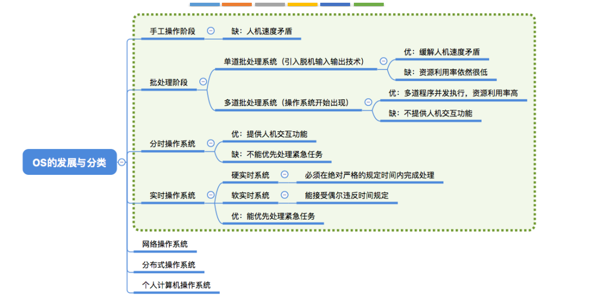

某计算机采用二级页表的分页存储管理方式 ，按字节编址 ，页大小为210 字节，页表项大小为2字节，逻辑地址结构为

| 页目 录号 | 页号 | 页内偏移量 |
| --------- | ---- | ---------- |

逻辑地址空间大小为216 页，则表示 整个 逻辑地址空间的页 目录表 中包含表项的个数至少是()

页面大小 = 2^10 字节

页表项大小 = 2 字节

每个页表中最多页表项数 = 2^10 / 2 = 2^9

页目录表中最多项数 n = 2^16 / 2^9 = 2^7 =128

在页式存储管理中，当前进程的页表起始地址存放在( PTBR (页表基址寄存器))中。

系统调用的目的是：请求系统服务

> 操作系统不允许用户直接操作各种硬件资源，因此用户程序只能通过系统调用的方式来请求内核为其服务，间接地使用各种资源

用户在程序中试图读某文件的第100个逻辑块，使用操作系统提供的**系统调用**接口

> 操作系统通过系统调用向用户程序提供服务，文件I/O需要在内核态运行

操作系统与用户通信接口通常不包括**缓存管理指令**

> 广义指令 系统调用指令
>
> 命令解释器 命令接口
>
> shell 命令解析器 命令接口
>
> 系统中的缓存全部由操作系统管理，对用户是透明的，操作系统不提供管理系统缓存的系统调用

下列选项中，不属于多到程序设计的基本特征是**顺序性**

> 引入多道程序设计后，程序的执行就失去了封闭性和顺序性。程序执行因为共享资源及相互协同的原因产生了竞争，相互制约。考虑到竞争的公平性，程序的执行是断续的。顺序性是单道程序设计的基本特征。

计算机开机后，操作系统最终被加载到**RAM**

> 系统开机后，操作系统的程序会被自动加载到内存中的系统区，这段区域是RAM。

|          | 区别                                                         | 联系                                                         |
| -------- | ------------------------------------------------------------ | :----------------------------------------------------------- |
| 库函数   | 库函数是语言或应用程序的一部分，可以运行在用户空间中。       | 未使用系统调用的库函数，其执行效率通常要比系统调用的高。因为使用系统调用时，斋要上下文的切换及状态的转换（由用户态转向核心态）。 |
| 系统调用 | 系统调用是操作系统的一部分，是内核为用户提供的程序接口，运行在内核空间中，而且许多库函数都会使用系统调用米实现功能。 |                                                              |

- 批处理系统分为单道批处理系统和多道批处理系统
- 中断技术使得多道批处理系统和I/O设备可与CPU并行工作

> 多道程序设计技术允许同时把多个程序放入内存，并允许它们交替在CPU中运行，它们共享系统中的各种硬/软件资源，当一道程序因I/O请求而暂停运行时，CPU便立即转去运行另一道程序，即多道批处理系统的I/O设备可与CPU并行工作，这都是借助于中断技术实现的

在通用操作系统管理下的计算机上运行程序，需要向操作系统预订运行时间 

> 通用操作系统使用时间片轮转调度算法，用户运行程序并不需要预先预订运行时间

在通用操作系统管理下的计算机上运行程序，需要确定起始地址，并从这个地址开始执行

> 传递系统调用参数 -> 执行陷入指令（用户态）-> 执行相应的内请求核程序处理系统调用（核心态）-> 返回应用程序
>
> 陷入指令 = trap指令 = 访管指令

用户程序在用户态下要使用特权指令引起的中断属于**访管中断**

> 因操作系统不允许用户直接执行某些“危险性高”的指令，因此用户态运行这些指令的结果会转成操作系统的核心态去运行。这个过程就是访管中断。

处理器执行的指令被分为两类，其中有一类称为特权指令，它只允许**操作系统**使用。

> 内核可以执行处理器能执行的任何指令，用户程序只能执行除特权指令外的指令。所以特权指令只能由内核即操作系统使用。

下列操作系统的多个功能组成部分中，**进程调度**可不需要硬件的支持.

> 中断系统和地址映射显然都需要硬件支持，因为中断指令和地址映射中的重定位都是离不开硬件支持的。而时钟管理中，重置时钟等是由硬件直接完成的。进程调度由调度算法决定CU使用权，由操作系统实现，无须硬件的支持。

计算机区分核心态和用户态指今后，从核心态到用户态的转换是由操作系统程序执行后完成的，而用户态到核心态的转换则是由**硬件**完成的.

> 计算机通过硬件中断机制完成由用户态到核心态的转换。

下列选项中，不可能在用户态发生的事件是**进程切换**

> 本题的关键是对“在用户态发生”（与上题的“执行”区分）的理解。
>
> 对于**系统调用**,系统调用是操作系统提供给用户程序的接口，系统调用发生在用户态，被调用程序在核心态下执行。
>
> 对于**外部中断**,外部中断是用户态到核心态的“门”，也发生在用户态，在核心态完成中断过程。
>
> 对于**进程切换**,进程切换属于系统调用执行过程中的事件，只能发生在核心态：
>
> 对于**缺页**,缺页产生后，在用户态发生缺页中断，然后进入核心态执行缺页中断服务程序。

只能在核心态下运行的指令是**置时钟指令**

> 若在用户态下执行“置时钟指令”，则一个用户进程可在时间片还未到之前把时钟改回去，从而导致时间片永远不会用完，进而导致该用户进程-一直占用CPU,这显然不合理。

当CPU执行操作系统代码时，处理器处于**核心态**

在操作系统中，只能在核心态下执行的指令是**广义指令**

> 广义指令即系统调用命令，它必然工作在核心态。要注意区分“调用”和“执行”，广义指令的调用可能发生在用户态，调用广义指令的那条指令不一定是特权指令，但广义指令存在于核心态中，所以执行一定在核心态。

下列选项中，必须在核心态下执行的指令是**输入/输出**

> 输入/输出指令涉及中断操作，而中断处理是由系统内核负责的，工作在核心态。

下列选项中，会导致用户进程从用户态切换到内核态的操作是**整数除以零**和**read 系统调用**。

> 需要在系统内核态执行的操作是整数除零操作(需要中断处理)和read系统调用函数，sin()函数调用是在用户态下进行的。

中断处理和子程序调用都需要压栈以保护现场，中断处理一定会保存而子程序调用不需要保存其内容的是**程序状态字寄存器**。

> 子程序调用只需保存程序断点，即该指令的下一条指令的地址;
>
> 中断调用子程序不仅要保存断点(PC的内容)，还要保存程序状态字寄存器(PSW)的内容。在中断处理中，最重要的两个寄存器是PC和PSWR。
>
> 内核态->用户态：执行一条特权指令——修改PSW的标志位为“用户态”，这个动作意味着操作系统将主动让出CPU使用权 
>
> 用户态->内核态：由“中断”引发，硬件自动完成变态过程，触发中断信号意味着操作系统将强行夺回CPU的使用权

下列指令中，不能在用户态执行的是**关中断指令**

> trap指令、跳转指令和压栈指令均可以在用户态执行，其中trap指令负责由用户态转换为内核态。
>
> 关中断指令为特权指令，必须在核心态才能执行.
>
> 注意，在操作系统中，关中断指令是权限非常大的指令，因为中断是现代操作系统正常运行的核心保障之一，能把它关掉，说明执行这条指令的一定是权限非常大的机构(管态).

处理外部中断时，应该由操作系统保存的是**通用寄存器的内容**

> 外部中断处理过程，PC值由中断隐指令自动保存，而通用寄存器内容由操作系统保存。

假定下列指令巳装入指令寄存器,则执行时不可能导致CPU从用户态变为内核态(系统态)的是( ).
A. DIV RO, R1	;(R0)/(R1)→R0
B.INT n			;产生软中断
**C. NOT RO		;寄存器RO的内容取非**
D. MOV R0, addr	;把地址addr处的内存数据放入寄存器RO

> 考虑到部分指令可能出现异常(导致中断)，从而转到核心态。指令A有除零异常的可能，指令B为中断指令，指令D有缺页异常的可能，指令C不会发生异常。

下列与中断相关的操作中，由操作系统完成的是**提供中断服务**、**初始化中断向量表**、**保存中断屏蔽字**

> 当CPU检测到中断信号后，由硬件自动保存被中断程序的断点(即程序计数器PC), I（保存被中断程序的中断点）错误。
> 之后，硬件找到该中断信号对应的中断向量，中断向量指明中断服务程序入口地址(各中断向量统一存放在中断向量表中，该表由操作系统初始化)。接下来开始执行中断服务程序,保存PSW、保存中断屏蔽字、保存各通用寄存器的值，并提供与中断信号对应的中断服务，中断
> 服务程序属于操作系统内核。

为什么说直到出现中断和通道技术后，多道程序概念才变得有用?

> 多道程序并发执行是指有的程序正在CPU上执行，而另一些程序正在I/O设备上进行传输，即通过CPU操作与外设传输在时间上的重叠必须有中断和通道技术的支持，原因如下:
> 1)通道是一种控制一台或多台外部设备的硬件机构，它一旦被启动就独立于CPU运行，因而做到了输入/输出操作与CPU并行工作。但早期CPU与通道的联络方法是由CPU向通道发出询问指令来了解通道工作是否完成的。若未完成，则主机就循环询问直到通道工作结束为止。因此，这种询问方式是无法真正做到CPU与I/O设备并行工作的。
>
> 2)在硬件上引入了中断技术。所谓中断，就是在输入输出结束时，或硬件发生某种故障时，由相应的硬件(即中断机构)向CPU发出信号，这时CPU立即停下工作而转向处理中断请求，待处理完中断后再继续原来的工作。
>
> 因此，通道技术和中断技术结合起来就可实现CPU与I/O设备并行工作，即CPU启动通道传输数据后便去执行其他程序的计算工作，而通道则进行输入/输出操作;当通道工作结束时，再通过中断机构向CPU发出中断请求，CPU则暂停正在执行的操作，对出现的中断进行处理，处理完后再继续原来的工作。这样，就真正做到了CPU与I/O设备并行工作。此时，多道程序的概念才变为现实。

相对于传统操作系统结构，采用微内核结构设计和实现操作系统具有诸多好处，下列( )是微内核结构的特点。

I. 使系统更高效
**II.添加系统服务时，不必修改内核**
III.微内核结构没有单一内核稳定
**IV.使系统更可靠**

> 微内核结构将操作系统的很多服务移动到内核以外(如文件系统)，且服务之间使用进程间通信机制进行信息交换，这种通过进程间通信机制进行的信息交换影响了系统的效率，所以I错。
>
> 由于内核的服务变少，且一般来说内核的服务越少内核越稳定，所以II错.
>
> 而III、IV 正是微内核结构的优点。

**A.线程包含CPU现场，可以独立执行程序**
B.每个线程有自己独立的地址空间
C.进程只能包含一个线程
D.线程之间的通信必须使用系统调用函数

> 线程是处理机调度的基本单位，当然可以独立执行程序，A对;
>
> 线程没有自己独立的地址空间，它共享其所属进程的空间，B错;
>
> 进程可以创建多个线程，C错;
>
> 与进程之间线程的通信可以直接通过它们共享的存储空间，D错。

**A.进程获得处理器运行是通过调度得到的**
B.优先级是进程调度的重要依据，一旦确定不能改动
C.在单处理器系统中，任何时刻都只有一个进程处于运行态
D.进程申请处理器而得不到满足时，其状态变为阻塞态

> 选项B错在优先级分静态和动态两种,动态优先级是根据运行情况而随时调整的。
>
> 选项c错在系统发生死锁时有可能进程全部都处于阻塞态，或无进程任务，CPU空闲。
>
> 选项D错在进程申请处理器得不到满足时就处于就绪态，等待处理器的调度。

在任何时刻，一个进程的状态变化**不一定**引起另一个进程的状态变化。

> 一个进程的状态变化可能会引起另一个进程的状态变化。例如，一个进程时间片用完，可能会引起另一个就绪进程的运行。
>
> 同时，一个进程的状态变化也可能不会引起另一个进程的状态变化。例如，一个进程由阻塞态转变为就绪态就不会引起其他进程的状态变化。

系统进程所请求的一次1/O操作完成后，将使进程状态从**阻塞态变为就绪态**

> I/O操作完成之前进程在等待结果，状态为阻塞态;完成后进程等待事件就绪，变为就绪态。

并发进程失去封闭性，是指**并发进程共享变量，其执行结果与速度有关**

> 程序封闭性是指进程执行的结果只取决于进程本身，不受外界影响。也就是说，进程在执行过程中不管是不停顿地执行，还是走走停停，进程的执行速度都不会改变它的执行结果。失去封闭性后，不同速度下的执行结果不同。

通常用户进程被建立后,**随着进程运行的正常或不正常结束而撤销**

> 进程有它的生命周期，不会一直存在于系统中，也不一定需要用户显式地撤销。进程在时间片结束时只是就绪，而不是撤销。阻塞和唤醒是进程生存期的中间状态。进程可在完成时撤销,或在出现内存错误等时撤销。

进程是一个独立的运行单位，也是操作系统进行资源分配和调度的基本单位，它包括PCB、
程序和数据以及执行栈区，仅仅说进程是在多程序环境下的完整程序是不合适的，因为程序是静态的，它以文件形式存放于计算机硬盘内，而进程是动态的。

> c语言编写的程序在使用内存时一般分为三个段，它们一般是正文段(即代码和赋值数据段)、数据堆段和数据栈段。
>
> 二进制代码和常量存放在正文段，
>
> 动态分配的存储区在数据堆段，
>
> 临时使用的变量在数据栈段。
>
> 由此，我们可以确定**全局赋值变量**在正文段赋值数据段，
>
> **未赋值的局部变量**和**实参传递**在栈段，
>
> **动态内存分配**在堆段，
>
> **常量在正文段**，
>
> 进程的优先级只能在PCB内。

同一程序经过多次创建，运行在不同的数据集上，形成了**不同**的进程。

> 一个进程是程序在一个数据集上的一次运行过程。运行于不同的数据集，将会形成不同的进程。

对进程的管理和控制功能是通过**执行各种原语**来实现的，如创建原语等。

> **设备分配**是通过在系统中设置相应的数据结构实现的，不需要创建进程，这是操作系统中I/O核心子系统的内容。

在同一进程中，线程的切换不会引起进程的切换。当从一个进程中的线程切换到另一个进程中的线程时，才会引起进程的切换。

在以下描述中，( )并不是多线程系统的特长。
A.利用线程并行地执行矩阵乘法运算
B.Web服务器利用线程响应HTTP请求
**C.键盘驱动程序为每个正在运行的应用配备一个线程， 用以响应该应用的键盘输入**
D.基于GUI的调试程序用不同的线程分别处理用户输入、计算和跟踪等操作

> 整个系统只有一个键盘，而且键盘输入是人的操作，速度比较慢，完全可以使用一个线程来处理整个系统的键盘输入。

在引入线程后，进程依然是资源分配的基本单位，线程是调度的基本单位，同一进程中的各
个线程共享进程的地址空间。在用户级线程中，有关线程管理的所有工作都由应用程序完成，无须内核的干预，内核意识不到线程的存在。

下列选项中，可能导致当前进程P阻塞的事件是

**I. 进程P申请临界资源**
**II.进程P从磁盘读数据**
III.系统将CPU分配给高优先权的进程

> 进程等待某资源为可用(不包括处理机)或等待输入/输出完成均会进入阻塞态，因此I、
> II正确; III 中情况发生时，进程进入就绪态，因此III错误。

下列选项中，可能会将进程唤醒的事件是( )。
**I. I/O结束**
**II.某进程退出临界区**
III.当前进程的时间片用完

> 当被阻塞进程等待的某资源(不包括处理机)可用时，进程将会被唤醒。I/O结束后，等待该I/O结束而被阻塞的有关进程会被唤醒，I正确
>
> 某进程退出临界区后，之前因需要进入该临界区而被阻塞的有关进程会被唤醒，II正确
>
> 当前进程的时间片用完后进入就绪队列等待重新调度，优先级最高的进程获得处理机资源从就绪态变成执行态，III 错误。

下列关于线程的描述中，错误的是( ).
A.内核级线程的调度由操作系统完成
**B.操作系统为每个用户级线程建立一个线程控制块**
C.用户级线程间的切换比内核級线程间的切换效率高
D.用户级线程可以在不支持内核级线程的操作系统上实现

> 应用程序没有进行线程管理的代码，只有一个到内核级线程的编程接口,内核为进程及其内部的每个线程维护上下文信息，调度也是在内核中由操作系统完成的，A正确。
>
> 在多线程模型中，用户级线程和内核级线程的连接方式分为多对一、一对一、 多对多，“操作系统为每个用户线程建立一个线程控制块” 属于一对一模型， B错误。
>
> 一对一模型：一个用户级线程映射到一个内核级线程。每个用户进程有与用户级线程同 数量的内核级线程。
>
> 用户级线程的切换可以在用户空间完成，内核级线程的切换需要操作系统帮助进行调度,因此用户级线程的切换效率更高，c正确。
>
> 用户级线程的管理工作可以只在用户空间中进行，因此可以在不支持内核级线程的操作系统上实现，D正确。

下列关于父进程与子进程的叙述中，错误的是( ).
A.父进程与子进程可以并发执行
**B.父进程与子进程共享虚拟地址空间**
C.父进程与子进程有不同的进程控制块
D.父进程与子进程不能同时使用同一临界资源

> 父进程与子进程当然可以并发执行，A正确。
>
> 父进程可与子进程共享一部分资源， 但不能共享虚拟地址空间，在创建子进程时，会为子进程分配资源，如虚拟地址空间等，B错误。
>
> 临界资源一次只能为一个进程所用，D正确。
>
> 进程控制块(PCB)是进程存在的唯一标志，每个进程都有自己的PCB，C正确。

