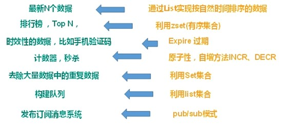
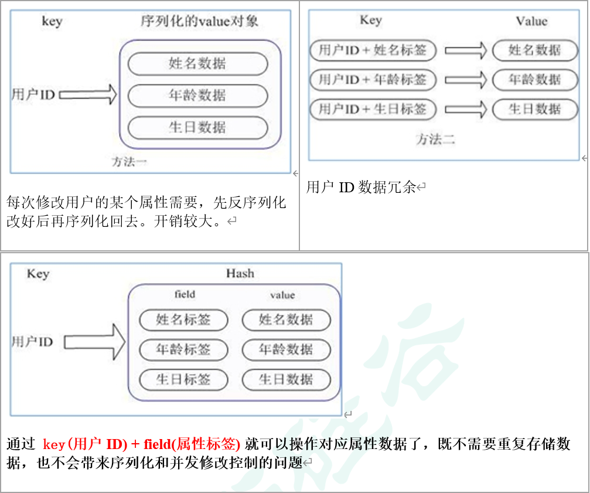
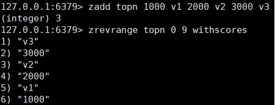

# Redis概述

1. Redis是一个**开源**的**key-value**存储系统。
2. 和Memcached类似，它支持存储的value类型相对更多，包括**string**(字符串)、**list**(链表)、**set**(集合)、**zset**(sorted set --有序集合)和**hash**(哈希类型)。
3. 这些数据类型都支持push/pop、add/remove及取交集并集和差集及更丰富的操作，而且这些操作都是**原子性**的。
4. 在此基础上，Redis支持各种不同方式的**排序**。
5. 与memcached一样，为了保证效率，数据都是**缓存在内存**中。
6. 区别的是Redis会**周期性**的把**更新的数据写入磁盘**或者把修改操作写入追加的记录文件。
7. 并且在此基础上实现了**master-slave(主从)**同步。

[Redis官方网站](http://redis.io)

[Redis中文网](https://www.redis.net.cn/)

## Redis键(key)

keys *查看当前库所有key  (匹配：keys *1)

exists key判断某个key是否存在

type key 查看你的key是什么类型

del key    删除指定的key数据

unlink key  根据value选择非阻塞删除

仅将keys从keyspace元数据中删除，真正的删除会在后续异步操作。

expire key 10  10秒钟：为给定的key设置过期时间

ttl key 查看还有多少秒过期，-1表示永不过期，-2表示已过期

 

select命令切换数据库

dbsize查看当前数据库的key的数量

flushdb清空当前库

flushall通杀全部库

## Redis字符串(String)

String类型是二进制安全的。意味着Redis的string可以包含任何数据。比如jpg图片或者序列化的对象。

String类型是Redis最基本的数据类型，一个Redis中字符串value最多可以是512M

*NX：当数据库中key不存在时，可以将key-value添加数据库

*XX：当数据库中key存在时，可以将key-value添加数据库，与NX参数互斥

*EX：key的超时秒数

*PX：key的超时毫秒数，与EX互斥

 

get  <key>查询对应键值

append <key><value>将给定的<value> 追加到原值的末尾

strlen <key>获得值的长度

setnx <key><value>只有在 key 不存在时  设置 key 的值

 

incr <key>

将 key 中储存的数字值增1

只能对数字值操作，如果为空，新增值为1

decr <key>

将 key 中储存的数字值减1

只能对数字值操作，如果为空，新增值为-1

incrby / decrby <key><步长>将 key 中储存的数字值增减。自定义步长。

mset <key1><value1><key2><value2> ..... 

同时设置一个或多个 key-value对 

mget <key1><key2><key3> .....

同时获取一个或多个 value 

msetnx <key1><value1><key2><value2> ..... 

同时设置一个或多个 key-value 对，当且仅当所有给定 key 都不存在。

**原子性，有一个失败则都失败**

getrange <key><起始位置><结束位置>

获得值的范围，类似java中的substring，**前包，后包**

setrange <key><起始位置><value>

用 <value> 覆写<key>所储存的字符串值，从<起始位置>开始(**索引从0开始**)。

**setex <key><过期时间><value>**

设置键值的同时，设置过期时间，单位秒。

getset <key><value>

以新换旧，设置了新值同时获得旧值。

### 数据结构

String的数据结构为简单动态字符串(Simple Dynamic String,缩写SDS)。是可以修改的字符串，内部结构实现上类似于Java的ArrayList，采用预分配冗余空间的方式来减少内存的频繁分配.

如图中所示，内部为当前字符串实际分配的空间capacity一般要高于实际字符串长度len。当字符串长度小于1M时，扩容都是加倍现有的空间，如果超过1M，扩容时一次只会多扩1M的空间。需要注意的是字符串最大长度为512M。

## Redis列表(List)

单键多值

Redis 列表是简单的字符串列表，按照插入顺序排序。你可以添加一个元素到列表的头部（左边）或者尾部（右边）。

它的底层实际是个双向链表，对两端的操作性能很高，通过索引下标的操作中间的节点性能会较差。

### 常用命令

lpush/rpush <key><value1><value2><value3> .... 从左边/右边插入一个或多个值。

lpop/rpop <key>从左边/右边吐出一个值。值在键在，值光键亡。

 

rpoplpush <key1><key2>从<key1>列表右边吐出一个值，插到<key2>列表左边。

 

lrange <key><start><stop>

按照索引下标获得元素(从左到右)

lrange mylist 0 -1  0左边第一个，-1右边第一个，（0-1表示获取所有）

lindex <key><index>按照索引下标获得元素(从左到右)

llen <key>获得列表长度 

 

linsert <key> before <value><newvalue>在<value>的后面插入<newvalue>插入值

lrem <key><n><value>从左边删除n个value(从左到右)

lset<key><index><value>将列表key下标为index的值替换成value

### 数据结构

List的数据结构为快速链表quickList。

首先在列表元素较少的情况下会使用一块**连续的内存存储**，这个结构是**ziplist，也即是压缩列表**。

它将所有的元素紧挨着一起存储，分配的是一块连续的内存。

当数据量比较多的时候才会改成quicklist。

因为普通的链表需要的附加指针空间太大，会比较浪费空间。比如这个列表里存的只是int类型的数据，结构上还需要两个额外的指针prev和next。

Redis将链表和ziplist结合起来组成了quicklist。也就是将多个ziplist使用双向指针串起来使用。这样既满足了快速的插入删除性能，又不会出现太大的空间冗余。

## Redis集合(Set)

Redis set对外提供的功能与list类似是一个列表的功能，特殊之处在于set是可以**自动排重**的，当你需要存储一个列表数据，又不希望出现重复数据时，set是一个很好的选择，并且set提供了判断某个成员是否在一个set集合内的重要接口，这个也是list所不能提供的。

Redis的Set是string类型的无序集合。它底层其实是一个value为null的hash表，所以添加，删除，查找的复杂度都是O(1)。

一个算法，随着数据的增加，执行时间的长短，如果是O(1)，数据增加，查找数据的时间不变

### 常用命令

sadd <key><value1><value2> ..... 

将一个或多个 member 元素加入到集合 key 中，已经存在的 member 元素将被忽略

smembers <key>取出该集合的所有值。

sismember <key><value>判断集合<key>是否为含有该<value>值，有1，没有0

scard<key>返回该集合的元素个数。

srem <key><value1><value2> .... 删除集合中的某个元素。

spop <key>**随机从该集合中吐出一个值。**

srandmember <key><n>随机从该集合中取出n个值。不会从集合中删除 。

smove <source><destination>value把集合中一个值从一个集合移动到另一个集合

sinter <key1><key2>返回两个集合的交集元素。

sunion <key1><key2>返回两个集合的并集元素。

sdiff <key1><key2>返回两个集合的**差集**元素(key1中的，不包含key2中的)

### 数据结构

Set数据结构是dict字典，字典是用哈希表实现的。

Java中HashSet的内部实现使用的是HashMap，只不过所有的value都指向同一个对象。Redis的set结构也是一样，它的内部也使用hash结构，所有的value都指向同一个内部值。

## Redis哈希(Hash)

Redis hash 是一个键值对集合。

Redis hash是一个string类型的field和value的映射表，hash特别适合用于存储对象。

类似Java里面的Map<String,Object>

用户ID为查找的key，存储的value用户对象包含姓名，年龄，生日等信息，如果用普通的key/value结构来存储

主要有以下2种存储方式：

### 常用命令

hset <key><field><value>给<key>集合中的 <field>键赋值<value>

hget <key1><field>从<key1>集合<field>取出 value 

hmset <key1><field1><value1><field2><value2>... 批量设置hash的值

hexists<key1><field>查看哈希表 key 中，给定域 field 是否存在。 

hkeys <key>列出该hash集合的所有field

hvals <key>列出该hash集合的所有value

hincrby <key><field><increment>为哈希表 key 中的域 field 的值加上增量 1  -1

hsetnx <key><field><value>将哈希表 key 中的域 field 的值设置为 value ，当且仅当域 field 不存在 .

### 数据结构

Hash类型对应的数据结构是两种：ziplist（压缩列表），hashtable（哈希表）。当field-value长度较短且个数较少时，使用ziplist，否则使用hashtable。

## Redis有序集合Zset(sorted set)

Redis有序集合zset与普通集合set非常相似，是一个没有重复元素的字符串集合。

不同之处是有序集合的每个成员都关联了一个**评分**（score）,这个评分（score）被用来按照从最低分到最高分的方式排序集合中的成员。集合的成员是唯一的，但是评分可以是重复了 。

因为元素是有序的, 所以你也可以很快的根据评分（score）或者次序（position）来获取一个范围的元素。

访问有序集合的中间元素也是非常快的,因此你能够使用有序集合作为一个没有重复成员的智能列表。

### 常用命令

zadd <key><score1><value1><score2><value2>…

将一个或多个 member 元素及其 score 值加入到有序集 key 当中。

**zrange <key><start><stop> [WITHSCORES]**  

返回有序集 key 中，下标在<start><stop>之间的元素

带WITHSCORES，可以让分数一起和值返回到结果集。

zrangebyscore key minmax [withscores] [limit offset count]

返回有序集 key 中，所有 score 值介于 min 和 max 之间(包括等于 min 或 max )的成员。有序集成员按 score 值递增(从小到大)次序排列。 

zrevrangebyscore key maxmin [withscores] [limit offset count]        

同上，改为从大到小排列。 

zincrby <key><increment><value>   为元素的score加上增量

zrem <key><value>删除该集合下，指定值的元素

zcount <key><min><max>统计该集合，分数区间内的元素个数 

zrank <key><value>返回该值在集合中的排名，从0开始。

案例：如何利用zset实现一个文章访问量的排行榜？

### 数据结构

SortedSet(zset)是Redis提供的一个非常特别的数据结构，一方面它等价于Java的数据结构Map<String, Double>，可以给每一个元素value赋予一个权重score，另一方面它又类似于TreeSet，内部的元素会按照权重score进行排序，可以得到每个元素的名次，还可以通过score的范围来获取元素的列表。

zset底层使用了两个数据结构

（1）hash，hash的作用就是关联元素value和权重score，保障元素value的唯一性，可以通过元素value找到相应的score值。

（2）跳跃表，跳跃表的目的在于给元素value排序，根据score的范围获取元素列表。

#### 跳跃表（跳表）

集合的底层实现，可以用数组、平衡树、链表等。数组不便元素的插入、删除；平衡树或红黑树虽然效率高但结构复杂；链表查询需要遍历所有效率低。Redis采用的是跳跃表。跳跃表效率堪比红黑树，实现远比红黑树简单。

对比有序链表和跳跃表，从链表中查询出51

1. 有序链表

要查找值为51的元素，需要从第一个元素开始依次查找、比较才能找到。共需要6次比较。

1.  跳跃表

从第2层开始，1节点比51节点小，向后比较。

21节点比51节点小，继续向后比较，后面就是NULL了，所以从21节点向下到第1层

在第1层，41节点比51节点小，继续向后，61节点比51节点大，所以从41向下

在第0层，51节点为要查找的节点，节点被找到，共查找4次。

 

从此可以看出跳跃表比有序链表效率要高

