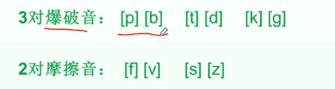

[Etymonline - Online Etymology Dictionary](https://www.etymonline.com/)

[优词词典 - 英语词根词源字典 - 在线英语单词助记词典 (dictool.com)](https://www.dictool.com/)

词根：单词中带有**主要词汇信息**的字母组合

| word    | 词根                      | 含义                       |
| ------- | ------------------------- | -------------------------- |
| secure  | se分离  cure = care  关心 | adj.安全的，放心的 vt.保护 |
| decade  | dec = ten                 | n.十年                     |
| justice | just                      | n.公平，公正               |
| advise  | vis 看                    |                            |

词缀：点缀词根而构成单词的字母或字母组合

前缀和后缀

前缀：“方向”或“强调”

| 方向   |      |             |
| ------ | ---- | ----------- |
| in-    | 入   | input       |
| ex-    | 出   | exit        |
| super- | 上   | supermarket |
| sub-   | 下   | subway      |
| 强调   |      |             |
| en-    |      | enlarge     |
| con-   |      | confirm     |
| as-    |      | assure      |
| be-    |      | beloved     |

后缀：“词性” 

-ion 名词

-ify 动词

### 单个元音字母互换：

| same           | -sim- -sem-  -sym- |
| -------------- | ------------------ |
| similar        |                    |
| simulate       |                    |
| simulation     |                    |
| simultaneously |                    |
| seem           |                    |
| resemble       |                    |
| assemble       |                    |
| symbol         |                    |
| symphony       |                    |
| simple         |                    |
| some           |                    |

| ball n.球；舞会（ballet） | 基本含义：鼓；膨胀 |
| ------------------------- | ------------------ |
| balloon                   |                    |
| belly                     |                    |
| belt                      |                    |
| seatbelt                  | 安全带             |
| bull                      | n.公牛 vt.价格上涨 |
| bullet、booklet、bracelet | let 小 little      |
| ballot                    | 投票               |
| bill                      | 法案；账单         |
| bulletin                  | 公告               |
| boil                      |                    |

### 多个元音字母互换

| blood    |      |
| -------- | ---- |
| bleed    |      |
| food     |      |
| feed     |      |
| feedback |      |

| sit    |      |
| ------ | ---- |
| seat   |      |
| set    |      |
| settle |      |

| cheek |      |
| ----- | ---- |
| choke |      |
| chew  |      |

### 元音字母增加或删减

| school      |                 |
| ----------- | --------------- |
| scholar     |                 |
| scholarship | ship 形态，性质 |

| found       |      |
| ----------- | ---- |
| founder     |      |
| foundation  |      |
| fund        |      |
| refund      |      |
| fundamental |      |

| intuition | 直觉 （不教）（instinct 本能） |
| --------- | ------------------------------ |
| tuition   |                                |
| tutor     |                                |
| tutorial  |                                |

### 元音字母互换巩固：词缀变化下的元音字母互换

| fact                      | 事实，真相 |
| ------------------------- | ---------- |
| -fact-=-fect-=fict-=-fic- | 做         |
| affect                    |            |
| affection                 |            |
| effect                    |            |
| effective                 |            |
| infect                    |            |
| infectious                |            |
| perfect                   |            |
| fiction                   |            |
| Sci-Fi                    | 科幻电影   |
| efficient                 |            |
| efficiency                |            |
| office                    |            |
| officer                   |            |
| official                  |            |
| sacrifice                 |            |
| sacred                    |            |
| artificial                |            |

### 练习

| deep   | dip                                                                       |
| ------ | ------------------------------------------------------------------------- |
| drop   | drip                                                                      |
| gather | togather                                                                  |
| turn   | return                                                                    |
|        | overturn                                                                  |
|        | disturb                                                                   |
|        | disturbance                                                               |
|        | turbulence  颠簸                                                            |
|        | tour                                                                      |
|        | tourist              tourism 旅游业                                          |
|        | travel 出差，苦差事          travail    辛苦工作                                    |
|        | trip           trap                                                       |
|        | journey           journal 日志        journalist记者       journalism新闻业      |
| middle | medium                                                                    |
|        | media                                                                     |
|        | intermediate                                                              |
|        | medieval 中世纪的 -al 的        ev 时间 ever  longevity万岁            **ag~~e~~** |
|        | immediate                                                                 |
| letter | literacy读写能力                                                              |
|        | literary文学的                                                               |
|        | literally字面的                                                              |
|        | literature 文学                                                             |
|        | illiterate文盲的，不识字的  in①进入②否定          ir il都是来自in，变形为了方便读                 |
| fail   | failure                                                                   |
|        | fall                                                                      |
|        | false                                                                     |
|        | fault                                                                     |
| lack   | leak                                                                      |
|        | lake                                                                      |

### 最常出现的辅音通假现象

 元音：口腔器官合作发出的音，叫做元音   

辅音：气流受到口腔器官**阻碍**发出的音，叫做辅音

元音字母：a e i o u

#### 清浊辅音通假

| purse    |                 |                 |
| -------- | --------------- | --------------- |
|          | burse           |                 |
|          | reimburse 报销  |                 |
| describe | description     | increase        |
|          | script     scar | decrease        |
|          | subscribe       | lay             |
|          | subscription    | delay           |
|          | subscriber      | title           |
|          | prescribe开药方 | subtitle        |
|          | prescription    | substitute 取代 |

| bend 弯曲 | bent 弯曲的   |
| --------- | ------------- |
| hut       | hide          |
|           | house         |
| found     | fountain源泉  |
| sweet     | persuade 说服 |
| sit       | president     |
|           | residence     |
|           | resident      |

| action | agent代理人                                            |
| ------ | ------------------------------------------------------ |
|        | agency代理                                             |
|        | agenda会议日程                                         |
|        | agitate搅动；骚动；使激动                              |
| angle  | ankle                                                  |
|        | anchor锚                                               |
|        | triangle                                               |
|        | rectangle                                              |
|        | right                                                  |
| angry  | anxious 焦虑的                                         |
|        | anxiety                                                |
|        | anguish极度痛苦                                        |
| drag   | track                                                  |
|        | tractor拖拉机                                          |
|        | trace                                                  |
|        | attract                                                |
|        | attractive                                             |
|        | distract                                               |
|        | extract                                                |
|        | abstract           ad（at）朝    ab、abs、a 拉走，离去 |

| believe | belief         |
| ------- | -------------- |
| relieve | relief         |
|         | lift           |
|         | loft阁楼       |
|         | elevate        |
|         | elevator电梯   |
| achieve | chief          |
|         | chef厨师       |
| grave   | grief          |
| carve刻 | grieve感到悲痛 |
| graph写 | gravity        |
|         | aggravate      |

| advice | advise               |
| ------ | -------------------- |
|        | fence/fense栅栏      |
|        | defence/defense 防卫 |
| price  | prize                |
|        | praise               |
|        | appreciate           |
|        | precious             |

